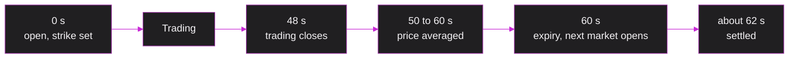

# Binary markets

A binary market pays a fixed amount if something happens and nothing if it does not. Every Phinary market asks whether ETH or SOL will be above a price, the **strike**, at a set time, the **expiry**.

## Two tokens

| Token | Symbol | Pays at expiry |
|---|---|---|
| YES | `ETHUP` | 1 USDC if ETH's average price over the settlement window (the last 10 seconds of a 1-minute market) is **above** the strike, otherwise 0 |
| NO | `ETHDOWN` | 1 USDC if that average is **at or below** the strike, otherwise 0 |

The symbol starts with the track's ticker: `ETHUP` and `ETHDOWN` for 1-minute ETH markets, `ETH15MUP` and `ETH15MDOWN` for 15-minute ones, and `SOLUP`, `SOLDOWN`, `SOL15MUP`, `SOL15MDOWN` for SOL.

Exactly one of the two pays, so one YES plus one NO is always worth exactly 1 USDC. That pair is called a **complete set**, and it is why the vault only has to hold enough USDC for the larger side.

## The price is a probability

A token pays 1 or 0, so its fair price is the chance that it pays. A YES price of 0.62 means the market gives YES a 62% chance.

| You buy 1 YES at 0.62 | You receive | Result |
|---|---|---|
| YES wins | 1.00 | +0.38, a 61% return |
| NO wins | 0.00 | −0.62 |

YES and NO prices add up to about 1. Buying costs a little more than the fair price (the **ask**) and selling pays a little less (the **bid**). With a YES ask of 0.62 and bid of 0.56, the NO ask is 1 − 0.56 = 0.44 and the NO bid is 1 − 0.62 = 0.38.

## A 1-minute market

Times count from the start of the market's minute.

| Time | What happens |
|---|---|
| 0 s | The market opens. The strike is the current price, so it starts close to 50/50 |
| 0 to 48 s | Anyone can buy and sell YES and NO |
| 48 s | Trading stops, 12 seconds before expiry |
| 50 to 60 s | The price is averaged over these 10 seconds |
| 60 s | Expiry. The next market of the same track opens in the same second |
| About 62 s | Anyone settles the market; the keeper usually does it within a few seconds |
| Any time after | Winners sell their tokens at 1.00 USDC each |

## A 15-minute market

The same steps on a longer clock. A market opens on the quarter hour, trades until 32 seconds before expiry, and settles on the average over its last 30 seconds:

| Time | What happens |
|---|---|
| 0:00 | The market opens, struck at the current price |
| 0:00 to 14:28 | Anyone can buy and sell YES and NO |
| 14:30 to 15:00 | The price is averaged over these 30 seconds |
| 15:00 | Expiry. The next 15-minute market opens |

ETH and SOL each run both lengths, four tracks in all. At every quarter hour all four expire together, and their names tell them apart: `ETH > $2689.62 26 Sep 15:30` is a 1-minute market, `ETH15M > $2689.62 26 Sep 15:30` a 15-minute one ([Scheduler and gatekeeper](/contracts/scheduler)).

## Example

A 1-minute market opens at 15:27:00 with a strike of 2,689.62 USD and an expiry of 15:28:00. At 15:27:20 Alice pays 5 USDC for 6.08 YES. Trading closes at 15:27:48.

- If ETH averages 2,690.10 USD over 15:27:50 to 15:28:00, YES wins and her 6.08 YES are worth 6.08 USDC.
- If it averages 2,689.62 USD or less, NO wins and her YES are worth nothing.

Next: [what moves the price](/concepts/pricing).
