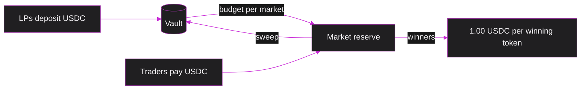

# The LP vault

The pools hold no liquidity. When you buy YES, the other side of your trade is a USDC vault that lives inside the hook, funded by liquidity providers (LPs).

## Where the money goes

1. **Budget.** Each new market borrows `min(10 USDC, idle / 2)` from the vault as its starting reserve.
2. **Trading.** Buyers' USDC is added to the reserve and sellers are paid from it.
3. **Solvency.** After every trade the reserve must cover the larger side: the number of YES or of NO tokens held by traders, whichever is higher. Every winning token is therefore always backed by 1 USDC.
4. **Sweep.** After settlement, everything above what winners can still claim goes back to the vault.

## Example

A market starts with a 10 USDC budget. Alice buys 8.02 YES for 5 USDC and Carol buys 11.40 NO for 5 USDC, so the reserve is 20 USDC.

| Result | Paid to winners | Back to the vault | Vault profit |
|---|---|---|---|
| YES wins | 8.02 | 11.98 | +1.98 |
| NO wins | 11.40 | 8.60 | −1.40 |

## Valuing LP shares

While markets are live, nobody knows the vault's exact value. The hook tracks two numbers instead:

- **NAV⁺**, the value if every live market ends in the vault's best case.
- **NAV⁻**, the value if every live market ends in its worst case.

In the example these are the two rows of the table: the market adds 11.98 to NAV⁺ and 8.60 to NAV⁻. Deposits are priced at NAV⁺ and withdrawals at NAV⁻, so nobody can buy shares cheaply just before a good result or walk away with USDC the vault may still owe. Neither number uses a price, so no oracle move can change the share price.

## Where LPs earn and lose

- **Earn:** the spread on every trade, and every trader who bets on the wrong side.
- **Lose:** when traders are right more often than the prices assumed.

Ready to deposit? See [Provide liquidity](/guides/liquidity).
