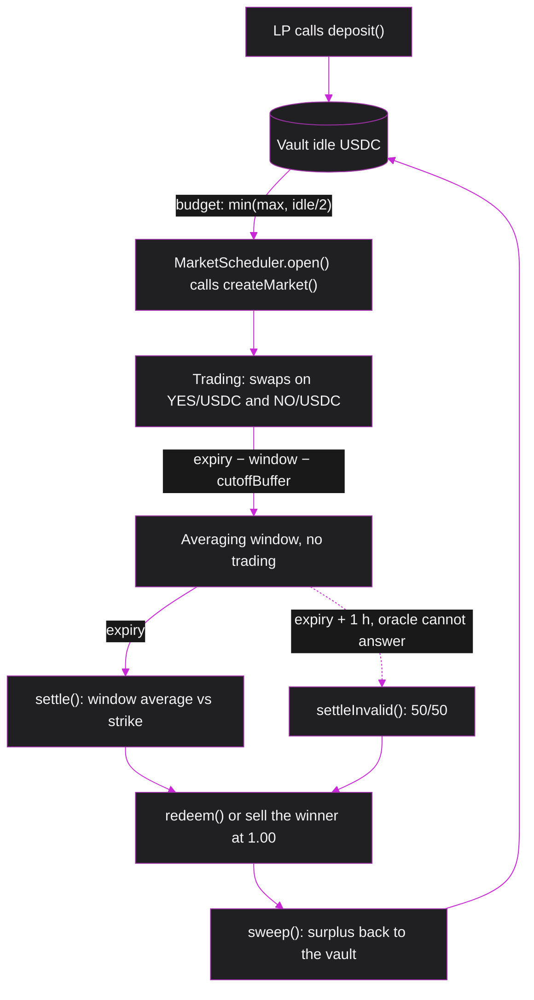

# PredictionHook

PredictionHook is a Uniswap v4 hook that turns two plain v4 pools, YES/USDC and NO/USDC, into a binary prediction market on the price of ETH. A market asks one question, for example "ETH above 2,684.53 USD at 00:48?". A winning token redeems for exactly 1 USDC and a losing token for nothing.

The hook prices every swap itself with a Black-Scholes binary formula, fills it through v4 custom accounting, and backs every token with USDC from an LP vault that lives inside the hook. The pools hold no liquidity. The only price source is a second v4 hook on an ETH/USDC pool, so the markets need **no external oracles and no external services**.

The v4 mechanics it relies on:

- **NoOp swaps.** `beforeSwap` returns a delta that cancels the whole swap amount, so the concentrated-liquidity curve never runs and the hook sets the price.
- **ERC-6909 claims.** The hook keeps all of its USDC and returned tokens as claims inside the PoolManager. A trade only adjusts claims, plus a mint of new outcome tokens straight into the PoolManager when inventory runs short.
- **Self-initialised pools.** Only the hook can create its pools. v4 skips `beforeInitialize` on self-calls, and the hook reverts it for everyone else.
- **A pool as the oracle.** `UnderlyingOracleHook` records the start-of-block ETH price, v3-style tick cumulatives and realised variance from one v4 pool.
- **Standard routing.** Traders use UniversalRouter and V4Quoter exactly like any other v4 pool.

## Lifecycle



1. LPs deposit USDC into the vault inside the hook ([`deposit`](#deposit-withdraw-unlockcallback)).
2. Anyone calls `MarketScheduler.open()` once per time slot. It sets the strike at the current price and calls [`createMarket`](#createmarket), which moves a budget from the vault into the new market.
3. Traders swap USDC for YES or NO through UniversalRouter. Each swap runs [`_beforeSwap`](#_beforeswap), which quotes, fills and books it.
4. Trading stops before the settlement window starts. [`settle`](#settle) then compares the window's average price with the strike.
5. Winners redeem with [`redeem`](#redeem) or sell back through a normal swap at 1.00. [`sweep`](#sweep) returns the surplus to the vault.

The demo configuration (<Source path="script/base/SchedulerPair.sol" />) opens a market every 60 s. Each market lasts 120 s, trading stops 12 s before expiry (a 10 s window plus a 2 s buffer), and two markets overlap, so one is always tradable.

## Contracts around the hook

| Contract | Role |
|---|---|
| <Source path="src/PredictionHook.sol" /> | Markets, swaps, settlement, redemption and the LP vault |
| <Source path="src/oracle/UnderlyingOracleHook.sol" /> | Second v4 hook on the ETH/USDC pool: start-of-block price, tick cumulatives, realised variance |
| <Source path="src/MarketScheduler.sol" /> | Ownerless owner of the hook; `open()` creates one market per slot, callable by anyone |
| <Source path="src/OutcomeToken.sol" /> | The YES and NO ERC-20s (6 decimals), minted and burned only by the hook |
| <Source path="src/math/BinaryPricer.sol" /> | Black-Scholes binary price and spread |
| <Source path="src/math/QuoteMath.sol" /> | Exact integer fill amounts with linear price impact |
| <Source path="src/hook/StrikeMath.sol" /> | Settlement threshold in oracle ticks |

Off chain, the keeper bot (<Source path="bot/src/keeper.ts" />) opens, settles and sweeps markets. The mirror bot (<Source path="bot/src/mirror.ts" />) keeps the testnet ETH/USDC pool near the real ETH price through `PriceSteerer`, a job arbitrageurs do on mainnet. `@phinary/swap-sdk` (<Source path="packages/swap-sdk/src/swap.ts" />) quotes and encodes swaps, the Ponder indexer (<Source path="indexer/src/trades.ts" />) turns hook events into history, and the dashboard in `web/` and a fork of the Uniswap interface (`interface-patches/`) trade through the same pools.

## Permissions

### `getHookPermissions`

<Source path="src/PredictionHook.sol" lines="119-126" />

```solidity showLineNumbers{119}
function getHookPermissions() public pure override returns (Hooks.Permissions memory p) {
    p.beforeInitialize = true;
    p.beforeAddLiquidity = true;
    p.beforeRemoveLiquidity = true;
    p.beforeSwap = true;
    p.beforeSwapReturnDelta = true;
    p.beforeDonate = true;
}
```

v4 reads a hook's permissions from the low 14 bits of its address, so the deploy script mines a CREATE2 salt that sets bits 13, 11, 9, 7, 5 and 3 (<Source path="script/base/SchedulerPair.sol" />).

- `beforeSwap` plus `beforeSwapReturnDelta` let the hook replace the curve and settle both legs of every swap.
- `beforeInitialize`, `beforeAddLiquidity`, `beforeRemoveLiquidity` and `beforeDonate` are enabled only to **revert** ([blocked callbacks](#blocked-callbacks)).

### Constructor and `setKeeper`

<Source path="src/PredictionHook.sol" lines="114-134" />

```solidity showLineNumbers{114}
constructor(IPoolManager poolManager_, address usdc_, address owner_) BaseHook(poolManager_) {
    usdc = usdc_;
    owner = owner_;
}

function getHookPermissions() public pure override returns (Hooks.Permissions memory p) {
    p.beforeInitialize = true;
    p.beforeAddLiquidity = true;
    p.beforeRemoveLiquidity = true;
    p.beforeSwap = true;
    p.beforeSwapReturnDelta = true;
    p.beforeDonate = true;
}

/* Admin */

function setKeeper(address keeper_) external {
    if (msg.sender != owner) revert Unauthorized();
    keeper = keeper_;
    emit KeeperSet(keeper_);
}
```

`owner` is immutable. In the permissionless deployment (<Source path="script/DeployScheduler.s.sol" />) the owner is the `MarketScheduler`, which has no admin, no setter and never calls `setKeeper`, so `keeper` stays `address(0)`. Nobody can create a market outside the schedule, change a market's parameters or choose an outcome.

## Market state

### `Market` and `PoolRef`

<Source path="src/PredictionHook.sol" lines="35-68" />

```solidity showLineNumbers{35}
struct Market {
    address yes;
    uint64 openTime;
    uint32 window;
    address no;
    uint64 expiry;
    uint32 cutoffBuffer;
    address oracle;
    uint32 nSamples;
    uint8 sigmaMode;
    Status status;
    bool yesWon;
    uint64 h0Wad;
    uint64 gammaSWad;
    uint64 pMinWad;
    uint128 lambdaWad;
    uint128 qEpochMax;
    uint64 epochTs;
    int192 epochFlow;
    int256 lnStrikeWad;
    int256 settleThreshold;
    uint256 fixedVarE36;
    uint256 budget;
    uint256 bucket;
    uint256 outYes;
    uint256 outNo;
    uint256 invYes;
    uint256 invNo;
}

struct PoolRef {
    uint128 marketId;
    bool isYes;
}
```

One hook serves every market. `_pools` maps each v4 `PoolId` to its market and side, so a swap on any YES or NO pool finds its market in one storage read.

| Group | Fields | Meaning |
|---|---|---|
| Timing | `openTime`, `expiry`, `window`, `cutoffBuffer` | Trading runs from `openTime` until `expiry − window − cutoffBuffer`; settlement averages the last `window` seconds |
| Pricing | `oracle`, `lnStrikeWad`, `nSamples`, `sigmaMode`, `fixedVarE36`, `h0Wad`, `gammaSWad` | Inputs of the Black-Scholes price and spread |
| Impact | `lambdaWad`, `qEpochMax`, `pMinWad`, `epochTs`, `epochFlow` | Linear price impact inside one block timestamp, its cap and the tradable price band |
| Ledger | `budget`, `bucket`, `outYes`, `outNo`, `invYes`, `invNo` | USDC owned by the market, tokens held by traders, tokens held back by the hook |
| Outcome | `status`, `yesWon`, `settleThreshold` | `Trading`, `Settled` or `Invalid`, and the precomputed settlement test |

**Solvency rule.** While trading, every mutation must end with

$$
\text{bucket} \ge \max(\text{outYes}, \text{outNo})
$$

One YES plus one NO always redeems for exactly 1 USDC and only one side can win, so the bucket has to cover the larger side, not the sum. With 8 YES and 3 NO outstanding, 8 USDC pays every winner whichever way the market settles.

### Vault and global state

<Source path="src/PredictionHook.sol" lines="97-112" />

```solidity showLineNumbers{97}
address public immutable usdc;
address public immutable owner;
address public keeper;

uint256 public marketCount;
uint256 public vaultIdle;
uint256 public totalShares;
mapping(address => uint256) public sharesOf;

/// @dev Sum over markets of (bucket - min(outYes,outNo)) while trading, (bucket - required) once resolved
uint256 internal _sumPlus;
/// @dev Sum over markets of (bucket - max(outYes,outNo)) while trading, (bucket - required) once resolved
uint256 internal _sumMinus;

mapping(uint256 => Market) internal _markets;
mapping(bytes32 => PoolRef) internal _pools;
```

`vaultIdle` is USDC not committed to any market. `_sumPlus` and `_sumMinus` are running totals that give the vault's value in O(1) ([NAV](#navplus-navminus-_contrib-_updatenav)).

## Creating a market

### `MarketScheduler.open`

<Source path="src/MarketScheduler.sol" lines="63-72" />

```solidity showLineNumbers{63}
function open() external returns (uint256 marketId) {
    uint256 slot = block.timestamp / _period;
    if (slot <= lastSlot) revert AlreadyOpened(slot);
    lastSlot = slot;

    uint256 budget = _budget();
    uint256 expiry = slot * _period + _tenor;
    uint256 cents = MarketNames.strikeCents(IUnderlyingOracle(oracle).lnSpotSoBWad());
    (string memory yesName, string memory noName, string memory yesSymbol, string memory noSymbol) =
        MarketNames.names(_ticker(), cents, expiry);
```

`open()` is permissionless and succeeds once per `period`-second slot. The strike is the oracle's current start-of-block price rounded to cents, so every market starts at the money. The budget is `min(maxBudget, vaultIdle / 2)`, so one market never takes the whole vault. The keeper bot calls it on every slot, but any account can.

### `createMarket`

<Source path="src/PredictionHook.sol" lines="137-186" />

```solidity showLineNumbers{137}
function createMarket(MarketParams calldata p) external returns (uint256 id) {
    if (msg.sender != owner && msg.sender != keeper) revert Unauthorized();
    if (p.kernel != 0) revert UnsupportedKernel();
    if (
        p.oracle == address(0) || p.window == 0 || p.expiry > type(uint32).max || p.sigmaMode > 1
            || (p.sigmaMode == 1 && p.fixedVarE36 == 0) || p.quote.qEpochMax == 0 || p.quote.pMinWad == 0
            || p.quote.pMinWad >= WAD / 2
            || uint256(p.openTime > block.timestamp ? p.openTime : block.timestamp) + p.window + p.cutoffBuffer
                >= p.expiry
    ) revert InvalidParams();
    if (p.budget > vaultIdle) revert InsufficientIdle();

    id = ++marketCount;
    Market storage m = _markets[id];
    address yes = address(new OutcomeToken{salt: keccak256(abi.encode(id, true))}(p.yesName, p.yesSymbol, id, true));
    address no = address(new OutcomeToken{salt: keccak256(abi.encode(id, false))}(p.noName, p.noSymbol, id, false));
    m.yes = yes;
    m.no = no;
    m.oracle = p.oracle;
    m.openTime = p.openTime;
    m.expiry = p.expiry;
    m.window = p.window;
    m.cutoffBuffer = p.cutoffBuffer;
    m.nSamples = p.nSamples;
    m.sigmaMode = p.sigmaMode;
    m.fixedVarE36 = p.fixedVarE36;
    m.h0Wad = p.quote.h0Wad;
    m.gammaSWad = p.quote.gammaSWad;
    m.lambdaWad = p.quote.lambdaWad;
    m.qEpochMax = p.quote.qEpochMax;
    m.pMinWad = p.quote.pMinWad;
    m.lnStrikeWad = p.lnStrikeWad;
    m.settleThreshold = StrikeMath.threshold(p.lnStrikeWad, IUnderlyingOracle(p.oracle).decimalsShift(), p.window);
    m.status = Status.Trading;
    m.budget = p.budget;
    m.bucket = p.budget;
    vaultIdle -= p.budget;
    _sumPlus += p.budget;
    _sumMinus += p.budget;

    PoolKey memory yesKey = _key(yes);
    PoolKey memory noKey = _key(no);
    bytes32 yesId = PoolId.unwrap(yesKey.toId());
    bytes32 noId = PoolId.unwrap(noKey.toId());
    _pools[yesId] = PoolRef(uint128(id), true);
    _pools[noId] = PoolRef(uint128(id), false);
    poolManager.initialize(yesKey, SQRT_PRICE_1_1);
    poolManager.initialize(noKey, SQRT_PRICE_1_1);
    emit MarketCreated(id, yes, no, yesId, noId, p.lnStrikeWad, p.expiry);
}
```

1. **Checks.** Only the owner (the scheduler) or the keeper may call. The trading window must be non-empty, `pMin` must be below 0.5 and only the Gaussian kernel is enabled in this build.
2. **Budget.** `budget` leaves `vaultIdle` and becomes the market's `bucket`, which is also its first reserve.
3. **Tokens.** YES and NO are deployed with CREATE2 salts `(id, isYes)`, so their addresses are deterministic.
4. **Settlement test.** `settleThreshold` is computed once from the strike ([StrikeMath](#strikemaththreshold)).
5. **Pools.** Two `PoolKey`s with fee 0, tick spacing 60 and `hooks = this`, initialised at price 1:1. The price is cosmetic because the curve never runs. The hook calls `poolManager.initialize` itself, and v4's `noSelfCall` rule skips `beforeInitialize` for the hook's own calls.
6. **Event.** `MarketCreated` carries both pool ids; the indexer builds its market table from it.

### Blocked callbacks

<Source path="src/PredictionHook.sol" lines="190-219" />

```solidity showLineNumbers{190}
function _beforeInitialize(address, PoolKey calldata, uint160) internal pure override returns (bytes4) {
    revert ForeignInitialize();
}

function _beforeAddLiquidity(address, PoolKey calldata, ModifyLiquidityParams calldata, bytes calldata)
    internal
    pure
    override
    returns (bytes4)
{
    revert LiquidityDisabled();
}

function _beforeRemoveLiquidity(address, PoolKey calldata, ModifyLiquidityParams calldata, bytes calldata)
    internal
    pure
    override
    returns (bytes4)
{
    revert LiquidityDisabled();
}

function _beforeDonate(address, PoolKey calldata, uint256, uint256, bytes calldata)
    internal
    pure
    override
    returns (bytes4)
{
    revert DonateDisabled();
}
```

- **`beforeInitialize`** reverts, so nobody else can attach this hook to a pool and fake a market.
- **`beforeAddLiquidity` and `beforeRemoveLiquidity`** revert. The hook is the only market maker, and LP capital enters through [`deposit`](#deposit-withdraw-unlockcallback).
- **`beforeDonate`** reverts, which keeps the claim balances equal to the ledger.

## The swap path

A trader swaps through UniversalRouter with `V4_SWAP` and the actions `SWAP_EXACT_IN_SINGLE` (or `EXACT_OUT`), `SETTLE_ALL` and `TAKE_ALL`, the same as for any v4 pool. V4Quoter simulates the same `beforeSwap`, so quotes and fills always agree.

### `_beforeSwap`

<Source path="src/PredictionHook.sol" lines="221-247" />

```solidity showLineNumbers{221}
function _beforeSwap(address sender, PoolKey calldata key, SwapParams calldata params, bytes calldata)
    internal
    override
    returns (bytes4, BeforeSwapDelta, uint24)
{
    bytes32 poolId = PoolId.unwrap(key.toId());
    PoolRef memory ref = _pools[poolId];
    if (ref.marketId == 0) revert UnknownPool();
    Market storage m = _markets[ref.marketId];

    bool exactIn = params.amountSpecified < 0;
    uint256 amt = exactIn ? uint256(-params.amountSpecified) : uint256(params.amountSpecified);
    bool isBuy = Currency.unwrap(params.zeroForOne ? key.currency0 : key.currency1) == usdc;

    (uint256 q, uint256 cash) = _fill(m, ref.isYes, isBuy, exactIn, amt);
    _book(m, ref.isYes, isBuy, q, cash);

    (uint256 amtIn, uint256 amtOut) = isBuy ? (cash, q) : (q, cash);
    BeforeSwapDelta delta = exactIn
        ? toBeforeSwapDelta(amtIn.toInt128(), -amtOut.toInt128())
        : toBeforeSwapDelta(-amtOut.toInt128(), amtIn.toInt128());
    (int128 a0, int128 a1) =
        params.zeroForOne ? (amtIn.toInt128(), -amtOut.toInt128()) : (-amtOut.toInt128(), amtIn.toInt128());
    emit HookSwap(poolId, sender, a0, a1, 0, 0);
    emit Trade(ref.marketId, sender, ref.isYes, isBuy, q, cash, cash * WAD / q);
    return (IHooks.beforeSwap.selector, delta, 0);
}
```

1. **Find the market** from the `PoolId`. Unknown pools revert. `hookData` is ignored.
2. **Direction.** `exactIn` when `amountSpecified < 0`. `isBuy` when the input currency is USDC, which works for either token ordering.
3. **Fill** with [`_fill`](#_fill) (how many tokens for how much USDC) and **book** with [`_book`](#_book) (ledger, solvency, claims).
4. **Return the delta.** The specified delta is always `−amountSpecified`, so the PoolManager's amount left to swap is 0 and the curve is skipped:

| Swap | Specified delta | Unspecified delta |
|---|---|---|
| Exact in | `+amtIn` | `−amtOut` |
| Exact out | `−amtOut` | `+amtIn` |

5. **Events.** `HookSwap` is OpenZeppelin's standard event for custom-accounting hooks, so indexers see real amounts even though the pool itself never trades. `Trade` is the project's own event. Its `sender` is the router, not the user. The hook never needs the end user's address, and the indexer finds it from the token transfers (<Source path="indexer/src/lib/attribution.ts" />).

**Example.** Alice spends 5 USDC on YES, exact in. `amountSpecified = −5,000,000` (6 decimals). The hook returns a specified delta of `+5,000,000` and an unspecified delta of about `−8,024,800`: it takes her 5 USDC and owes her about 8.0248 YES. The router's `SETTLE_ALL` pays the USDC and `TAKE_ALL` sends her the YES.

### `_fill`

<Source path="src/PredictionHook.sol" lines="249-260" />

```solidity showLineNumbers{249}
/// @dev Token and USDC amounts of a swap, the input equals `amt` for exact-in and the output does for exact-out
function _fill(Market storage m, bool isYes, bool isBuy, bool exactIn, uint256 amt)
    internal
    returns (uint256 q, uint256 cash)
{
    Status st = m.status;
    if (st == Status.Trading) return _fillTrading(m, isYes, isBuy, exactIn, amt);
    if (isBuy || (st == Status.Settled && isYes != m.yesWon)) revert MarketClosed();
    if (st == Status.Settled) return (amt, amt);
    (q, cash) = exactIn ? (amt, amt / 2) : (amt * 2, amt);
    if (cash == 0) revert ZeroAmount();
}
```

| Status | Allowed swaps | Price |
|---|---|---|
| `Trading` | Buys and sells of YES and NO | Black-Scholes quote with impact ([`_fillTrading`](#_filltrading)) |
| `Settled` | Only sells of the winning token | Exactly 1.00 USDC, no spread, no impact |
| `Invalid` | Sells of either token | 0.50 USDC |

After settlement, redemption works through a normal swap, so any wallet or the Uniswap interface can cash out without a custom call.

### `_fillTrading`

<Source path="src/PredictionHook.sol" lines="262-298" />

```solidity showLineNumbers{262}
function _fillTrading(Market storage m, bool isYes, bool isBuy, bool exactIn, uint256 amt)
    internal
    returns (uint256 q, uint256 cash)
{
    (uint256 ask, uint256 bid) = _askBid(m);
    int256 flow = m.epochTs == block.timestamp ? int256(m.epochFlow) : int256(0);
    uint256 price;
    if (isYes) {
        price = isBuy ? ask : bid;
    } else if (isBuy) {
        price = WAD - bid;
    } else {
        if (ask >= WAD) revert OutOfBand();
        price = WAD - ask;
    }
    int256 i0 = isYes ? flow : -flow;
    uint256 lam = m.lambdaWad;
    uint256 pMin = m.pMinWad;
    _checkBand(pMin, price, lam, i0);
    if (isBuy) {
        (q, cash) = exactIn
            ? (QuoteMath.buyExactIn(price, lam, i0, amt), amt)
            : (amt, QuoteMath.buyExactOut(price, lam, i0, amt));
    } else {
        (q, cash) = exactIn
            ? (amt, QuoteMath.sellExactIn(price, lam, i0, amt))
            : (QuoteMath.sellExactOut(price, lam, i0, amt), amt);
    }
    if (q == 0 || cash == 0) revert ZeroAmount();

    int256 dq = SafeCast.toInt256(q);
    int256 f = isYes == isBuy ? flow + dq : flow - dq;
    if ((f < 0 ? uint256(-f) : uint256(f)) > m.qEpochMax) revert EpochCapExceeded();
    _checkBand(pMin, price, lam, isYes ? f : -f);
    m.epochTs = uint64(block.timestamp);
    m.epochFlow = int192(f);
}
```

- **One price, two pools.** The hook prices YES only. Buying NO costs `1 − bidYes` and selling NO pays `1 − askYes`. YES plus NO is always worth 1 USDC, so the two pools can never be arbitraged against each other.
- **Epoch flow.** `epochFlow` is the net YES-equivalent amount traded in the current `block.timestamp` (a YES buy adds, a NO buy subtracts). The marginal price moves by `lambda` per whole token of flow and resets when the timestamp changes. The NO pool sees the flow mirrored, so YES buying makes NO cheaper within the same block.
- **Exact amounts.** [`QuoteMath`](#quotemath) solves the fill on that straight line in integers, always rounding against the trader.
- **Checks.** Every marginal price, before and after the fill, must stay inside `[pMin, 1 − pMin]` ([`_checkBand`](#_checkband)), `|flow|` must stay within `qEpochMax`, and both amounts must be non-zero.

The mid price cannot move inside a block because the oracle reports the start-of-block price. The impact makes splitting one large order into many swaps in the same block pointless: every piece pays the flow that came before it.

**Example.** Demo parameters: `lambda = 0.001`, `qEpochMax = 100` tokens, `pMin = 0.02`. The YES ask is 0.6191 and the bid 0.5590 ([pricing example](#pricing-example)).

| Trade in one block | Flow before | Starting marginal price | Tokens for 5 USDC | Average price |
|---|---|---|---|---|
| Alice buys YES | 0 | 0.6191 | 8.0248 YES | 0.6231 |
| Carol buys NO | +8.0248 | 0.4410 − 0.0080 = 0.4330 | 11.3984 NO | 0.4387 |

In the next block the flow resets to 0 and the mid is read again from the oracle.

### `_checkBand`

<Source path="src/PredictionHook.sol" lines="300-304" />

```solidity showLineNumbers{300}
/// @dev The marginal price at mirrored flow x, price + lam * x / 1e6, must lie in [pMin, 1 - pMin]
function _checkBand(uint256 pMin, uint256 price, uint256 lam, int256 x) internal pure {
    int256 p = int256(price * QuoteMath.UNIT) + int256(lam) * x;
    if (p < int256(pMin * QuoteMath.UNIT) || p > int256((WAD - pMin) * QuoteMath.UNIT)) revert OutOfBand();
}
```

Checks the marginal price `price + lambda · x / 1e6` at a flow `x`. It is called with the flow before and after the trade, and because the price is linear in between, every executed price is inside the band.

### `QuoteMath`

<Source path="src/math/QuoteMath.sol" lines="40-52" />

```solidity showLineNumbers{40}
/// @notice USDC the trader pays for exactly q tokens (ceil).
function buyExactOut(uint256 a, uint256 lam, int256 i0, uint256 q) internal pure returns (uint256) {
    uint256 b = _beta(a, lam, i0, q);
    return FixedPointMathLib.divUp(lam * q * q + b * q, D);
}

/// @notice Max tokens q with cost(q) <= amtIn.
function buyExactIn(uint256 a, uint256 lam, int256 i0, uint256 amtIn) internal pure returns (uint256 q) {
    uint256 b = _beta(a, lam, i0, amtIn);
    uint256 r = amtIn * D;
    if (lam == 0) return r / b;
    q = (FixedPointMathLib.sqrt(b * b + 4 * lam * r) - b) / (2 * lam);
}
```

The cost of `q` tokens starting at flow `i0` is the area under the price line:

$$
\text{cost}(q) = \frac{\lambda q^2 + \beta q}{D}, \qquad \beta = 2 \cdot 10^6 \, p + 2 \lambda i_0, \qquad D = 2 \cdot 10^{24}
$$

Exact-out buys evaluate it and round up. Exact-in buys invert it with an integer square root and round down. A z3 proof shows the floor square root is exact for buys (<Source path="formal/z3_integer_lemmas.py" />). Sells use the mirrored formulas and stay on the rising branch of the curve.

### `_book`

<Source path="src/PredictionHook.sol" lines="306-349" />

```solidity showLineNumbers{306}
/// @dev Ledger effects, solvency post-check and NAV aggregates, then the PoolManager settlement of the hook's side
function _book(Market storage m, bool isYes, bool isBuy, uint256 q, uint256 cash) internal {
    (uint256 p0, uint256 n0) = _contrib(m);
    address tok = isYes ? m.yes : m.no;
    uint256 fromInv;
    if (isBuy) {
        m.bucket += cash;
        uint256 inv = isYes ? m.invYes : m.invNo;
        fromInv = q < inv ? q : inv;
        if (isYes) {
            m.outYes += q;
            m.invYes = inv - fromInv;
        } else {
            m.outNo += q;
            m.invNo = inv - fromInv;
        }
    } else {
        if (cash > m.bucket) revert Insolvent();
        m.bucket -= cash;
        if (isYes) {
            m.outYes -= q;
            m.invYes += q;
        } else {
            m.outNo -= q;
            m.invNo += q;
        }
    }
    _updateNav(m, p0, n0);

    uint256 usdcId = uint160(usdc);
    if (isBuy) {
        poolManager.mint(address(this), usdcId, cash);
        if (fromInv != 0) poolManager.burn(address(this), uint160(tok), fromInv);
        uint256 shortfall = q - fromInv;
        if (shortfall != 0) {
            poolManager.sync(Currency.wrap(tok));
            OutcomeToken(tok).mint(address(poolManager), shortfall);
            poolManager.settle();
        }
    } else {
        poolManager.mint(address(this), uint160(tok), q);
        poolManager.burn(address(this), usdcId, cash);
    }
}
```

**Ledger first.**

- A buy adds the USDC to `bucket` and the tokens to `outYes` or `outNo`. Tokens that earlier sellers returned (`invYes`, `invNo`) are handed out first, and only the rest is minted.
- A sell pays from `bucket`, reverting `Insolvent` if it cannot. The returned tokens go to inventory.
- `_updateNav` recomputes the market's contribution to the vault value. [`_contrib`](#navplus-navminus-_contrib-_updatenav) reverts `Insolvent` if `bucket < max(outYes, outNo)`, so **solvency is checked after every trade**.

**Then the PoolManager.**

| Trade | Input leg | Output leg |
|---|---|---|
| Buy | `mint(hook, USDC, cash)` keeps the trader's USDC as claims | `burn(hook, token, fromInv)` pays from inventory; the shortfall is `sync`, `OutcomeToken.mint(poolManager, …)`, `settle` |
| Sell | `mint(hook, token, q)` keeps the tokens as claims | `burn(hook, USDC, cash)` pays from the bucket's claims |

Minting straight into the PoolManager and settling is what lets `TAKE_ALL` deliver a freshly minted token. All USDC stays in the PoolManager as the hook's ERC-6909 claims, and the sum of all buckets plus `vaultIdle` equals the hook's USDC claim balance.

**Example.** The market started with a 10 USDC budget. After Alice and Carol: `bucket = 20`, `outYes = 8.0248`, `outNo = 11.3984`. The bucket covers the larger side, 20 ≥ 11.3984.

## Pricing

### `_askBid`, `_price`, `_inTradingWindow`

<Source path="src/PredictionHook.sol" lines="353-374" />

```solidity showLineNumbers{353}
function _askBid(Market storage m) internal view returns (uint256 ask, uint256 bid) {
    if (!_inTradingWindow(m)) revert NotTradable();
    (BinaryPricer.Result memory r,,) = _price(m, m.expiry - block.timestamp);
    (ask, bid) = BinaryPricer.askBid(r, m.gammaSWad, m.h0Wad);
}

function _price(Market storage m, uint256 tau)
    internal
    view
    returns (BinaryPricer.Result memory r, int256 x, uint256 varE36)
{
    IUnderlyingOracle o = IUnderlyingOracle(m.oracle);
    x = o.lnSpotSoBWad() - m.lnStrikeWad;
    if (m.sigmaMode == 0) (varE36,) = o.varianceE36();
    else varE36 = m.fixedVarE36;
    r = BinaryPricer.price(x, varE36, tau, m.window, m.nSamples);
}

function _inTradingWindow(Market storage m) internal view returns (bool) {
    return m.status == Status.Trading && block.timestamp >= m.openTime
        && block.timestamp + m.window + m.cutoffBuffer < m.expiry;
}
```

- **Trading window.** `openTime ≤ now` and `now + window + cutoffBuffer < expiry`. Trading closes before the averaging window opens, so nobody trades while the settlement price is being measured.
- **Moneyness.** $x = \ln(S / K)$, with $S$ from `oracle.lnSpotSoBWad()`: the start-of-block price, taken from `sqrtPriceX96` without tick rounding.
- **Volatility.** Per-second variance from `oracle.varianceE36()`, the realised variance of the same pool ([oracle](#the-oracle-side)), or a fixed value per market.

### `BinaryPricer`

<Source path="src/math/BinaryPricer.sol" lines="36-73" />

```solidity showLineNumbers{36}
function effectiveTimes(uint256 tau, uint256 window, uint256 n)
    internal
    pure
    returns (uint256 tDriftE18, uint256 tVarE18)
{
    if (tau <= window) revert TooLate();
    uint256 base = (tau - window) * 1e18;
    if (n == 0) {
        tDriftE18 = base + window * 1e18 / 2;
        tVarE18 = base + window * 1e18 / 3;
    } else {
        // (n-1)*Delta/2 = w*(n-1)/(2n) ; Delta*(n-1)*(2n-1)/(6n) = w*(n-1)*(2n-1)/(6n^2)
        tDriftE18 = base + window * 1e18 * (n - 1) / (2 * n);
        tVarE18 = base + F.fullMulDiv(window * 1e18, (n - 1) * (2 * n - 1), 6 * n * n);
    }
}

function _moments(int256 x, uint256 varE36, uint256 tau, uint256 window, uint256 n)
    private
    pure
    returns (Result memory r)
{
    (uint256 tDrift, uint256 tVar) = effectiveTimes(tau, window, n);
    r.sqrtV = F.sqrt(F.fullMulDiv(varE36, tVar, 1e18));
    if (r.sqrtV == 0) revert ZeroVariance();
    int256 mu = x - SafeCastLib.toInt256(F.fullMulDiv(varE36, tDrift, 2e36));
    r.d = mu * WAD / int256(r.sqrtV);
}

function price(int256 x, uint256 varE36, uint256 tau, uint256 window, uint256 n)
    internal
    pure
    returns (Result memory r)
{
    r = _moments(x, varE36, tau, window, n);
    r.mid = NormalCdf.cdf(r.d);
    r.pdf = NormalCdf.pdf(r.d);
}
```

The market does not pay on the price at one instant. It pays if the **average log price over the last `window` seconds**, sampled `n` times, is above the strike. Under Black-Scholes with zero rates that average is normally distributed, so the fair YES price is:

$$
\text{mid} = \Phi\!\left(\frac{\mu}{\sqrt{v}}\right), \qquad \mu = x - \tfrac{1}{2}\sigma^2 T_D, \qquad v = \sigma^2 T_V
$$

$$
T_D = (\tau - w) + \frac{w(n-1)}{2n}, \qquad T_V = (\tau - w) + \frac{w(n-1)(2n-1)}{6n^2}
$$

`effectiveTimes` computes $T_D$ and $T_V$. When the window shrinks to 0 this is the textbook European binary $N(d_2)$. Pricing the exact thing that settles leaves no gap between what traders pay and what the market pays out.

<Source path="src/math/BinaryPricer.sol" lines="94-107" />

```solidity showLineNumbers{94}
function askBid(Result memory r, uint256 gammaSWad, uint256 h0Wad) internal pure returns (uint256 ask, uint256 bid) {
    if (r.kernel == 0) {
        uint256 kappa = gammaSWad > GAMMA_MAX
            ? type(uint256).max
            : F.divUp(F.divUp(gammaSWad * 1e45, r.sqrtV), uint256(NormalCdf.SQRT_2PI_WAD));
        (uint256 up, uint256 dn) = NormalCdf.band(r.d, kappa);
        ask = up + h0Wad;
        bid = dn > h0Wad ? dn - h0Wad : 0;
    } else {
        ask = r.mid + F.fullMulDivUp(gammaSWad, r.pdf, r.sqrtV) + h0Wad;
        uint256 sub = F.fullMulDiv(gammaSWad, r.pdf, r.sqrtV) + h0Wad;
        bid = r.mid > sub ? r.mid - sub : 0;
    }
}
```

$$
\text{ask} = \Phi(d) + k\,\varphi(d) + h_0, \qquad \text{bid} = \Phi(d) - k\,\varphi(d) - h_0, \qquad k = \frac{\gamma_S}{\sqrt{v}}
$$

- $k\,\varphi(d)$ is how much the price would move if the spot were off by $\gamma_S$ in log terms. It widens the spread where the binary is most sensitive: near the strike and close to expiry.
- $h_0$ is a flat base half-spread.
- For the Gaussian kernel, $\Phi \pm k\varphi$ is rounded once inside `NormalCdf.band`, so ask and bid are monotone in the price. Certificates are in `formal/hart36/`.

### Pricing example

Strike 2,684.53 USD, start-of-block price 2,685.00 USD, 60 s to expiry, a 10 s window with 10 samples, and σ = 60% a year (the oracle's warm-up value). Demo spread parameters: `h0 = 0.02`, `gammaS = 0.00002`.

| Step | Value |
|---|---|
| $x = \ln(2685.00 / 2684.53)$ | 0.000175 |
| $T_D$, $T_V$ | 54.5 s, 52.85 s |
| $\sqrt{v}$ | 0.000776 |
| $d$ | 0.2251 |
| mid (YES) | 0.5890 |
| $k\,\varphi(d)$ | 0.0100 |
| YES ask / bid | 0.6191 / 0.5590 |
| NO ask / bid | 0.4410 / 0.3809 |

## Settlement

### `settle`

<Source path="src/PredictionHook.sol" lines="378-392" />

```solidity showLineNumbers{378}
/// @inheritdoc IPredictionHook
function settle(uint256 marketId) external {
    Market storage m = _market(marketId);
    if (m.status != Status.Trading) revert MarketClosed();
    if (block.timestamp < m.expiry) revert TooEarly();
    IUnderlyingOracle o = IUnderlyingOracle(m.oracle);
    uint32 t = uint32(m.expiry);
    int256 d = int256(o.cumulativeAt(t)) - int256(o.cumulativeAt(t - m.window));
    bool yesWon = d * 1e18 > m.settleThreshold;
    (uint256 p0, uint256 n0) = _contrib(m);
    m.status = Status.Settled;
    m.yesWon = yesWon;
    _updateNav(m, p0, n0);
    emit MarketSettled(marketId, yesWon, d, false);
}
```

Anyone can call it at or after `expiry`; the keeper bot does. `D = cum(T) − cum(T − window)` is the oracle's sum of tick × seconds over the window, so `D / window` is the average tick. Ticks are **normalised** so that "ETH up" is always "tick up", whichever token is `currency0`. YES wins if and only if `D · 1e18 > settleThreshold`.

### `StrikeMath.threshold`

<Source path="src/hook/StrikeMath.sol" lines="11-19" />

```solidity showLineNumbers{11}
/// @notice Strike as a normalised oracle tick in WAD, (lnStrikeWad - decimalsShift * ln10) / ln(1.0001)
function strikeTickWad(int256 lnStrikeWad, int16 decimalsShift) internal pure returns (int256) {
    return (lnStrikeWad * 1e18 - int256(decimalsShift) * LN10_E36) * 1e18 / LN_1_0001_E36;
}

/// @notice YES iff D * 1e18 > threshold with D = cum(T) - cum(T - window), a tie resolves NO
function threshold(int256 lnStrikeWad, int16 decimalsShift, uint32 window) internal pure returns (int256) {
    return int256(uint256(window)) * (strikeTickWad(lnStrikeWad, decimalsShift) - 0.5e18);
}
```

The strike becomes a fractional tick, and the threshold is `window · (strikeTick − 0.5)`. The oracle stores whole ticks rounded down, so the average reads half a tick low on average; the `− 0.5` removes that bias. A tie resolves NO.

**Example.** On the demo pool (WETH 18 decimals, USDC 6, `decimalsShift = 12`) a strike of 2,684.53 USD is tick −197,367.47. With a 10 s window, YES needs an average tick above −197,367.97.

### The oracle side

<Source path="src/oracle/UnderlyingOracleHook.sol" lines="202-221" />

```solidity showLineNumbers{202}
function _beforeSwap(address, PoolKey calldata key, SwapParams calldata, bytes calldata)
    internal
    override
    returns (bytes4, BeforeSwapDelta, uint24)
{
    Sob memory s = _sob;
    uint32 t = uint32(block.timestamp);
    if (s.time != t) _write(s, t, key.toId());
    return (this.beforeSwap.selector, BeforeSwapDeltaLibrary.ZERO_DELTA, 0);
}

/* IUnderlyingOracle */

function lnSpotSoBWad() external view returns (int256) {
    Sob memory s = _boundSob();
    uint160 sp = s.sqrtPriceX96;
    if (s.time != uint32(block.timestamp)) (sp,,,) = poolManager.getSlot0(poolId);
    int256 lnRaw = 2 * (F.lnWad(int256(uint256(sp))) + LN_WAD_TO_Q96);
    return int256(s.sign) * lnRaw + int256(_feed.decimalsShift) * LN10_WAD;
}
```

On the **first swap of each timestamp** the oracle hook records the pool's pre-swap `slot0`, which is the start-of-block state, and appends an observation `{time, tickCumulative}` just like v3's `Oracle.sol`. A read in a block with no write yet uses `slot0` directly, which is still the start-of-block state because every swap runs `beforeSwap` first. **Nothing traded earlier in the current block can move the price the hook quotes or settles against.**

<Source path="src/oracle/UnderlyingOracleHook.sol" lines="278-282" />

```solidity showLineNumbers{278}
uint256 hh = uint256(h);
varPerSecE36 = F.fullMulDiv(3 * (wEnd - wStart), LN_TICK_SQ_E36, 2 * hh * hh * hh * n);
if (varPerSecE36 < varMinE36) varPerSecE36 = varMinE36;
else if (varPerSecE36 > varMaxE36) varPerSecE36 = varMaxE36;
warm = true;
```

Volatility is the realised variance of 10 s average-price returns over the last 30 minutes (180 windows), scaled by 3/2 because averaging damps variance, with each window's move winsorised and the result clamped. Until 30 windows exist it returns a fallback of 60% a year.

### `settleInvalid` and `_oracleAnswers`

<Source path="src/PredictionHook.sol" lines="394-418" />

```solidity showLineNumbers{394}
/// @inheritdoc IPredictionHook
function settleInvalid(uint256 marketId) external {
    Market storage m = _market(marketId);
    if (m.status != Status.Trading) revert MarketClosed();
    if (block.timestamp <= m.expiry + GRACE) revert TooEarly();
    if (_oracleAnswers(m)) revert OracleAvailable();
    (uint256 p0, uint256 n0) = _contrib(m);
    m.status = Status.Invalid;
    _updateNav(m, p0, n0);
    emit MarketSettled(marketId, false, 0, true);
}

function _oracleAnswers(Market storage m) internal view returns (bool) {
    IUnderlyingOracle o = IUnderlyingOracle(m.oracle);
    uint32 t = uint32(m.expiry);
    try o.cumulativeAt(t - m.window) returns (int56) {}
    catch {
        return false;
    }
    try o.cumulativeAt(t) returns (int56) {}
    catch {
        return false;
    }
    return true;
}
```

A liveness fallback. If the oracle can no longer answer for `T − window` or `T` (the observation ring has moved past them) and one hour (`GRACE`) has passed since expiry, anyone can mark the market `Invalid`, and every token then pays 0.50. It reverts with `OracleAvailable` whenever a real settlement is possible, so it can never replace one.

## Redemption and sweep

### `redeem`

<Source path="src/PredictionHook.sol" lines="420-452" />

```solidity showLineNumbers{420}
/// @inheritdoc IPredictionHook
/// @dev Settled pays 1 USDC per winning token, Invalid pays floor(amount / 2) for tokens burned YES first then NO
function redeem(uint256 marketId, uint256 amount) external returns (uint256 payout) {
    Market storage m = _market(marketId);
    if (amount == 0) revert ZeroAmount();
    (uint256 p0, uint256 n0) = _contrib(m);
    Status st = m.status;
    if (st == Status.Settled) {
        payout = amount;
        if (m.yesWon) {
            OutcomeToken(m.yes).burn(msg.sender, amount);
            m.outYes -= amount;
        } else {
            OutcomeToken(m.no).burn(msg.sender, amount);
            m.outNo -= amount;
        }
    } else if (st == Status.Invalid) {
        payout = amount / 2;
        if (payout == 0) revert ZeroAmount();
        uint256 bal = OutcomeToken(m.yes).balanceOf(msg.sender);
        uint256 fromYes = amount < bal ? amount : bal;
        if (fromYes != 0) OutcomeToken(m.yes).burn(msg.sender, fromYes);
        if (amount != fromYes) OutcomeToken(m.no).burn(msg.sender, amount - fromYes);
        m.outYes -= fromYes;
        m.outNo -= amount - fromYes;
    } else {
        revert NotSettled();
    }
    m.bucket -= payout;
    _updateNav(m, p0, n0);
    poolManager.unlock(abi.encode(msg.sender, payout, false));
    emit Redeemed(marketId, msg.sender, amount, payout);
}
```

- **Settled:** burns winning tokens and pays 1 USDC each.
- **Invalid:** pays `floor(amount / 2)`, burning YES first and then NO.
- The payout runs inside `poolManager.unlock`, where [`unlockCallback`](#deposit-withdraw-unlockcallback) burns the hook's USDC claims and `take`s real USDC to the caller. Selling the winner through a swap at 1.00 gives the same result.

### `sweep`

<Source path="src/PredictionHook.sol" lines="454-465" />

```solidity showLineNumbers{454}
/// @inheritdoc IPredictionHook
function sweep(uint256 marketId) external returns (uint256 amount) {
    Market storage m = _market(marketId);
    Status st = m.status;
    if (st != Status.Settled && st != Status.Invalid) revert NotSettled();
    (uint256 p0, uint256 n0) = _contrib(m);
    amount = p0;
    m.bucket -= amount;
    vaultIdle += amount;
    _updateNav(m, p0, n0);
    emit Swept(marketId, amount);
}
```

After settlement, anything in the bucket above what winners can still claim goes back to `vaultIdle`. The keeper bot sweeps every settled market.

**Example.** Alice's market settles with `bucket = 20`:

| Outcome | Still owed to winners | Swept to vault | LP result on the 10 USDC budget |
|---|---|---|---|
| YES wins | 8.0248 | 11.9752 | +1.9752 |
| NO wins | 11.3984 | 8.6016 | −1.3984 |

## LP vault

### `deposit`, `withdraw`, `unlockCallback`

<Source path="src/PredictionHook.sol" lines="469-509" />

```solidity showLineNumbers{469}
/// @inheritdoc IPredictionHook
function deposit(uint256 assets) external returns (uint256 shares) {
    if (assets == 0) revert ZeroAmount();
    shares = assets * (totalShares + SHARE_OFFSET) / (navPlus() + 1);
    if (shares == 0) revert ZeroAmount();
    totalShares += shares;
    sharesOf[msg.sender] += shares;
    vaultIdle += assets;
    SafeTransferLib.safeTransferFrom(usdc, msg.sender, address(this), assets);
    poolManager.unlock(abi.encode(msg.sender, assets, true));
    emit Deposit(msg.sender, assets, shares);
}

/// @inheritdoc IPredictionHook
function withdraw(uint256 shares) external returns (uint256 assets) {
    if (shares == 0) revert ZeroAmount();
    if (shares > sharesOf[msg.sender]) revert InsufficientShares();
    assets = shares * (navMinus() + 1) / (totalShares + SHARE_OFFSET);
    if (assets == 0) revert ZeroAmount();
    if (assets > vaultIdle) revert InsufficientIdle();
    sharesOf[msg.sender] -= shares;
    totalShares -= shares;
    vaultIdle -= assets;
    poolManager.unlock(abi.encode(msg.sender, assets, false));
    emit Withdraw(msg.sender, assets, shares);
}

function unlockCallback(bytes calldata data) external onlyPoolManager returns (bytes memory) {
    (address to, uint256 amount, bool isDeposit) = abi.decode(data, (address, uint256, bool));
    Currency c = Currency.wrap(usdc);
    if (isDeposit) {
        poolManager.sync(c);
        SafeTransferLib.safeTransfer(usdc, address(poolManager), amount);
        poolManager.settle();
        poolManager.mint(address(this), uint160(usdc), amount);
    } else {
        poolManager.burn(address(this), uint160(usdc), amount);
        poolManager.take(c, to, amount);
    }
    return "";
}
```

- **Deposit** mints shares priced at `navPlus`; **withdraw** burns shares priced at `navMinus`. The difference is explained [below](#navplus-navminus-_contrib-_updatenav).
- The `1e6` share offset and the `+ 1` on assets are a virtual position that blocks the first-depositor inflation attack.
- Withdrawals are paid from `vaultIdle` only. USDC in a live market stays there until it is swept.
- Deposited USDC is moved into the PoolManager (`sync`, transfer, `settle`) and kept as the hook's ERC-6909 claims, the same form the market buckets use.

### `navPlus`, `navMinus`, `_contrib`, `_updateNav`

<Source path="src/PredictionHook.sol" lines="511-543" />

```solidity showLineNumbers{511}
/// @inheritdoc IPredictionHook
function navPlus() public view returns (uint256) {
    return vaultIdle + _sumPlus;
}

/// @inheritdoc IPredictionHook
function navMinus() public view returns (uint256) {
    return vaultIdle + _sumMinus;
}

/// @dev A market's (NAV+, NAV-) contribution, reverting Insolvent when the bucket is below the requirement
function _contrib(Market storage m) internal view returns (uint256 plus, uint256 minus) {
    uint256 b = m.bucket;
    uint256 y = m.outYes;
    uint256 n = m.outNo;
    Status st = m.status;
    uint256 hi;
    uint256 lo;
    if (st == Status.Trading) {
        (hi, lo) = y > n ? (y, n) : (n, y);
    } else {
        hi = st == Status.Settled ? (m.yesWon ? y : n) : (y + n + 1) / 2;
        lo = hi;
    }
    if (b < hi) revert Insolvent();
    return (b - lo, b - hi);
}

function _updateNav(Market storage m, uint256 p0, uint256 n0) internal {
    (uint256 p1, uint256 n1) = _contrib(m);
    _sumPlus = _sumPlus - p0 + p1;
    _sumMinus = _sumMinus - n0 + n1;
}
```

$$
\text{NAV}^{+} = \text{idle} + \sum_{\text{markets}} \big(\text{bucket} - \min(\text{outYes}, \text{outNo})\big)
$$

$$
\text{NAV}^{-} = \text{idle} + \sum_{\text{markets}} \big(\text{bucket} - \max(\text{outYes}, \text{outNo})\big)
$$

Each live market is valued at its best case (NAV⁺, the smaller side wins) and its worst case (NAV⁻, the larger side wins). Alice's market adds 11.9752 to NAV⁺ and 8.6016 to NAV⁻, exactly the two rows of the sweep table. Depositors pay the best case and withdrawers get the worst case, so nobody can buy vault shares cheaply before a good settlement or leave with money the vault may still owe.

Neither number reads a price, so no oracle move can change the share price. Both are kept as running sums updated on every trade, settlement, redemption and sweep, which keeps `deposit` and `withdraw` O(1) however many markets are open.

## Views

### `quote` and `quoteStrict`

<Source path="src/PredictionHook.sol" lines="547-572" />

```solidity showLineNumbers{547}
/// @inheritdoc IPredictionHook
/// @dev Never reverts for a known market: when pricing fails (oracle revert, zero variance) all fields but tau are 0
function quote(uint256 marketId) external view returns (Quote memory qt) {
    Market storage m = _market(marketId);
    try this.quoteStrict(marketId) returns (Quote memory r) {
        return r;
    } catch {
        if (block.timestamp < m.expiry) qt.tau = m.expiry - block.timestamp;
    }
}

/// @notice quote() that reverts when pricing fails
/// @dev Prices exclude the current epoch's impact and are zero once tau <= window
function quoteStrict(uint256 marketId) external view returns (Quote memory qt) {
    Market storage m = _market(marketId);
    qt.tradable = _inTradingWindow(m);
    if (block.timestamp >= m.expiry) return qt;
    qt.tau = m.expiry - block.timestamp;
    if (qt.tau <= m.window) return qt;
    BinaryPricer.Result memory r;
    (r, qt.xWad, qt.varE36) = _price(m, qt.tau);
    qt.midYes = r.mid;
    (qt.askYes, qt.bidYes) = BinaryPricer.askBid(r, m.gammaSWad, m.h0Wad);
    qt.askNo = WAD - qt.bidYes;
    qt.bidNo = qt.askYes >= WAD ? 0 : WAD - qt.askYes;
}
```

`quote` never reverts for a known market: if pricing fails, it returns zeros and the time to expiry. It gives the YES mid, ask and bid for both sides, the variance and the moneyness, and `@phinary/swap-sdk` reads it for the dashboard (<Source path="packages/swap-sdk/src/markets.ts" />). It leaves out the current block's impact, so exact fill amounts come from V4Quoter.

### Market lookups

<Source path="src/PredictionHook.sol" lines="574-645" />

```solidity showLineNumbers{574}
/// @notice Current epoch (block.timestamp of the last trade) and its signed YES-equivalent flow
function epochOf(uint256 marketId) external view returns (uint64 ts, int256 flow) {
    Market storage m = _market(marketId);
    return (m.epochTs, m.epochFlow);
}

/// @notice The settlement threshold, YES iff (cum(T) - cum(T - window)) * 1e18 > threshold
function settleThresholdOf(uint256 marketId) external view returns (int256) {
    return _market(marketId).settleThreshold;
}

/// @inheritdoc IPredictionHook
function marketInfo(uint256 marketId) external view returns (MarketInfo memory i) {
    Market storage m = _market(marketId);
    i.yes = m.yes;
    i.no = m.no;
    i.oracle = m.oracle;
    i.lnStrikeWad = m.lnStrikeWad;
    i.openTime = m.openTime;
    i.expiry = m.expiry;
    i.window = m.window;
    i.cutoffBuffer = m.cutoffBuffer;
    i.status = m.status;
    i.yesWon = m.yesWon;
    i.bucket = m.bucket;
    i.outYes = m.outYes;
    i.outNo = m.outNo;
    i.invYes = m.invYes;
    i.invNo = m.invNo;
}

/// @inheritdoc IPredictionHook
function marketParams(uint256 marketId) external view returns (MarketParams memory p) {
    Market storage m = _market(marketId);
    p.oracle = m.oracle;
    p.lnStrikeWad = m.lnStrikeWad;
    p.openTime = m.openTime;
    p.expiry = m.expiry;
    p.window = m.window;
    p.cutoffBuffer = m.cutoffBuffer;
    p.nSamples = m.nSamples;
    p.budget = m.budget;
    p.quote = QuoteParams(m.h0Wad, m.gammaSWad, m.lambdaWad, m.qEpochMax, m.pMinWad);
    p.sigmaMode = m.sigmaMode;
    p.fixedVarE36 = m.fixedVarE36;
    p.yesName = OutcomeToken(m.yes).name();
    p.yesSymbol = OutcomeToken(m.yes).symbol();
    p.noName = OutcomeToken(m.no).name();
    p.noSymbol = OutcomeToken(m.no).symbol();
}

/// @inheritdoc IPredictionHook
function poolKeys(uint256 marketId) external view returns (PoolKey memory yesKey, PoolKey memory noKey) {
    Market storage m = _market(marketId);
    return (_key(m.yes), _key(m.no));
}

/// @inheritdoc IPredictionHook
function marketOfPool(bytes32 poolId) external view returns (uint256 marketId, bool isYes) {
    PoolRef memory ref = _pools[poolId];
    return (ref.marketId, ref.isYes);
}

function _market(uint256 marketId) internal view returns (Market storage m) {
    if (marketId == 0 || marketId > marketCount) revert UnknownMarket();
    return _markets[marketId];
}

function _key(address outcome) internal view returns (PoolKey memory) {
    (address c0, address c1) = outcome < usdc ? (outcome, usdc) : (usdc, outcome);
    return PoolKey(Currency.wrap(c0), Currency.wrap(c1), 0, TICK_SPACING, IHooks(address(this)));
}
```

- `epochOf`: the current epoch timestamp and its net flow.
- `settleThresholdOf`: the precomputed settlement threshold.
- `marketInfo`, `marketParams`: the market's ledger and its creation parameters.
- `poolKeys`, `marketOfPool`: the two `PoolKey`s of a market, and the reverse lookup from a pool id.
- `_key` sorts the two currencies as v4 requires and fixes fee 0, tick spacing 60 and `hooks = this`, so anyone can rebuild a market's `PoolKey` from its token addresses.

## Integration notes

- **Quotes.** `V4Quoter.quoteExactInputSingle` and `quoteExactOutputSingle` with the market's `PoolKey`. Hook errors come back wrapped, and `@phinary/swap-sdk` decodes them (<Source path="packages/swap-sdk/src/errors.ts" />).
- **Swaps.** UniversalRouter command `0x10` (`V4_SWAP`), or `0x0a10` with `PERMIT2_PERMIT` first. Outcome tokens are Solady ERC-20s that give Permit2 an infinite allowance, so selling YES or NO needs only a Permit2 signature.
- **Routing.** The hosted Uniswap routing skips hook-priced pools that hold no liquidity unless the hook is allowlisted. Phinary therefore quotes with V4Quoter directly and runs its own fork of the Uniswap interface (`interface-patches/`) with these pools injected.
