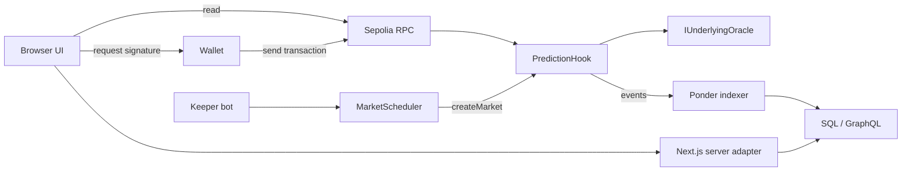

# フロントエンド接続計画

調査基準: `63a6c50`。2026-09-26 にユーザーが、リポジトリ内のデプロイ設定と indexer を完成版の接続先として指定。
既存 README 内の過去の Phase 番号とは別の、今回の接続作業の進捗表。

## Phase と完了条件

| Phase | 作業 | 完了条件 | 状態 |
|---|---|---|---|
| 1 | 接続仕様・差分・検証環境の把握 | 接続先、データの意味、既存実装との差分を記録し、基準テストを実行 | 完了 |
| 2 | 新構成の接続確認と市場読み取り | Hook / Scheduler / oracle の関連を検証。市場・価格・時刻・状態と失敗時の表示を確認 | 完了 |
| 3 | ウォレットと取引 | UP/DOWN 購入・売却、承認、最小受取量、署名拒否、リロード復旧を fork で確認 | 完了 |
| 4 | 保有・償還・Vault | 全市場の残高、勝利償還、無効返金、入出金を契約上の丸めと照合 | 完了 |
| 5 | 既存 indexer 接続 | GraphQL をフロント用に変換し、Activity・市場履歴・利用可能な集計を表示 | 実装・接続確認済（停止原因の修正・短時間再検証済） |
| 6 | 結合検証 | ブラウザ操作、チェーン結果、indexer 反映を一連で確認し、運用手順を記録 | ローカル fork 検証完了 |

各 Phase は「仕組みの説明 → 小さな変更 → 検証 → 結果と残課題の説明」の単位で進める。
コントラクト・バックエンドの既存仕様を基準にフロントを合わせる。未提供の情報を推測で埋めない。

## 1. 接続の全体像

読み取りは RPC または indexer。資産操作はユーザーのウォレットが署名する。
Indexer の反映は取引確定より遅れるため、取引成功・保有残高・履歴反映を別々に扱う。
最後の Next.js → SQL / GraphQL の接続は今回の実装対象であり、現状は未接続。

## 2. 正式な設定と役割

設定の出典: `deployments/unichain-sepolia.json`。

| 項目 | 設定値 / 役割 |
|---|---|
| Chain | Unichain Sepolia、1301 |
| PredictionHook | `0xE6780bBeAee4183Ffd8EBe0d2862dEd221B96aA8` |
| MarketScheduler | `0x511fFFb9fE5d393B10bF185A9c580A732Eff44Dd` |
| UnderlyingOracle | `0x1F356D9E7d6dBE6d807aCBc5D163a7af265cd080` |
| Indexing start | 63569270 |
| Collateral | Circle test USDC。デモプールの demoUsdc とは別トークン |
| Legacy Hook | `0x62bBCbA51cbFC8D0C932e482bD8F62590fEeeAa8` |

新しい `SealedPoolOracle` はソースに存在するが、この設定は従来の hooked demo pool を参照している。
新オラクルへのデプロイ変更は今回の接続に含めない。
両オラクルは `IUnderlyingOracle` を実装するため、フロントは内部の証明処理を再実装しない。

Scheduler が Hook の owner となり、誰でも時間枠ごとに `open()` を呼べる。
Keeper は市場作成・settle・sweep を進める運用プロセスで、ユーザーの取引署名者ではない。
一般ユーザーの画面に管理者用 `createMarket` 操作を追加する必要はない。

現状のフロントと indexer は現行 Hook のみを読む。legacy の配列が存在しても旧市場が自動的に統合されるわけではない。
今回の初期対象は現行 Hook。旧ポジションの移行・表示は別対応として明示する。

## 3. 画面とデータの対応

| 機能 | 正となる取得先 / 操作 | 既存フロント |
|---|---|---|
| 市場一覧・詳細 | Hook.marketCount / marketInfo / marketParams / quote | RPC 接続あり。一覧は最新30件、個別 ID は別取得 |
| ETH 価格・分散 | Oracle.lnSpotSoBWad / varianceE36 | Phase 2 で正式な2値 ABI と整合。warm を snapshot と診断に保持 |
| 購入・売却の見積もり | V4Quoter + swap-sdk | 実装あり。表示用 Hook.quote と取引数量の見積もりを区別 |
| 購入・売却 | 入力トークン承認 → 必要時 Permit2 署名 → UniversalRouter | UP/DOWN 両方向あり |
| 保有残高 | 全市場の UP/DOWN token.balanceOf | 現行 Hook 全登録市場を固定ブロックで読む |
| 償還・返金 | Hook.redeem | 実装あり。無効市場は両側残高を合算 |
| Vault | Hook.navPlus / navMinus / vaultIdle / totalShares / sharesOf | 読み取り・deposit / withdraw 実装あり |
| 市場チャート | indexer.priceSnapshot | usePriceHistory は未接続 |
| 市場の取引一覧 | indexer.trade + market | useMarketTrades は未接続 |
| 出来高・件数 | indexer.market.volumeUsdc / tradeCount | 現状 null |
| Activity | indexer.trade / transfer 等 | 現行 API は存在しない上流 /activity を要求 |
| 取得原価・損益 | indexer.position / accountStats | 現状 null。集計期間と原価の意味を合わせてから表示 |
| Vault 履歴 | indexer.vaultSnapshot / vaultEvent | 現在値と履歴を分けて接続する |

## 4. 単位と状態遷移

- USDC と UP/DOWN は小数6桁。署名する数量・最小受取量は bigint の整数で保持する。
- Quote の価格は WAD (1e18)。lnSpot/lnStrike は自然対数の WAD。
- varianceE36 は秒あたり分散 × 1e36。戻り値は `(uint256, bool warm)`。
- Vault シェアは既存フロントの12桁表示と整数計算を維持する。
- 時刻は Unix 秒。売買締切は `expiry - window - cutoffBuffer`。締切時刻ちょうどは売買不可。
- 満期到来だけでは決済済みにならない。勝敗は Hook の status / yesWon を読む。
- 決済は最終 window の累積 tick から判定し、同値は DOWN。現在のスポットで勝敗を推測しない。
- 勝利トークンは1単位につき同じ最小単位の USDC を償還。無効市場は UP+DOWN の amount に対し floor(amount/2)。
- 無効化には満期+1時間を超え、必要なオラクル履歴が得られない条件が必要。
- Vault の deposit は NAV+、withdraw は NAV−。引き出し額は vaultIdle の制限を受ける。
- Vault の idle + 市場 bucket は引き出し可能な純資産とは異なる。既存表示の区別を維持する。

## 5. 接続差分と対応方針

### Phase 2: 新構成の検証

Phase 2 で `web/src/lib/onchain/check-connection.ts` の確認を9アドレスへ拡張。
Scheduler に code があること、Hook.owner == Scheduler、Hook.keeper == zero、Scheduler.hook/oracle が設定と一致することを検証する。
診断は画面と同じ readMarkets を使い、最新30市場を検証して最新3件を報告。code・所有関係・市場・オラクルは同じブロックに固定する。
市場が存在することと、現在取引可能であることを分けて報告する。canOpen=false だけでは異常扱いしない。

`read-abis.ts` に read-only ABI を置き、varianceE36 を正式な `(uint256, bool)` に合わせた。
warm を市場 snapshot / useEthPrice / 診断に保持。warm=false は診断上の警告とし、独自に全取引を禁止しない。
市場情報の失敗はエラー、見積もりやオラクル値の取得失敗は当該情報を未取得にする。

### Phase 3–4: 既存操作の新構成での検証

`web/scripts/helpers/fork.mts` は owner を impersonate して createMarket を直接実行し、固定 oracle を注入する。
これは売買や償還の決定的な試験には使えるが、Scheduler.open と実オラクルの連携を検証しない。
その試験と、Scheduler 経由の市場を使う結合試験の結果を区別する。
Phase 3 で `startFixture({ marketSource: 'scheduler' })` を追加。通常のテストアカウントが実際の Scheduler.open を呼び、既存 oracle の市場を生成してフロントの売買処理を検証する。
このモードでは owner impersonation や oracle のコード置換を行わない。

### Phase 5: 履歴アダプター

`indexer/src/api/index.ts` が提供する `/sql/*` と `/graphql` に Next.js サーバーから接続する。
バックエンドに架空の `/activity` を要求する既存処理を置き換え、UI への変換はフロント側に持つ。
実際の schema・ページング・同期状況は indexer 起動後に検証し、API 名やパラメータを推測で実装しない。

UI が欲しい項目の全てを現在のテーブルから導けるわけではない。

- position.realized と accountStats.realizedTrade は累積値。直近1時間の実現損益イベントと同一視しない。
- 受領トークンは received bucket に原価0で記録される。購入原価が判明したという意味ではない。
- trade の口座帰属には transfer と txFrom fallback がある。確定的な帰属と区別する。
- transfer の redeem 行には実際の payout がない。特に無効市場の両側合算返金は、トークン別の単純な半額計算と端数が違い得る。
- 完全性を示す専用テーブルは見当たらない。全件ページングや同期状態の確認なしに tradesComplete/accountingComplete=true にしない。
- 市場の avgNormTickTimesWindow は USD 価格そのものではない。換算条件を確認してから settlementPrice を表示する。
- 取引のない時間にも同期は進む。最新 Trade の時刻を indexer の同期時刻として使わない。

不足項目は N/A とし、時間軸・集計の意味が合うデータから接続する。

## 6. Phase 1 の検証記録

- `web/npm test` は最初 tsx 未インストールで起動失敗。
- lockfile に従って `npm ci --no-audit --no-fund` を実行し、依存を復元。
- 復元後 `npm test`: 64 passed / 0 failed。
- Node は v25.8.2。vitest 5 の engines 対象外の警告あり。web の npm test は Node test runner で成功。indexer 検証前に対応 Node を使用する。
- フロント・コントラクト・indexer の実装変更はまだ行っていない。
- 公開チェーンへのトランザクション送信なし。
- RPC 診断は最初の実行環境では HttpRequestError。ネットワーク許可付きの読み取り専用の再確認は成功。
- 2026-09-26 12:18:52 UTC、Sepolia block 63572703: 設定済み8アドレスに code が存在し、Hook の collateral と USDC 6 decimals が一致。市場数53、最新3市場を SDK で取得。市場53は確認時点で取引可能、warnings は空。
- この診断は TypeScript から既存 checkConnection を直接呼んだ結果。Next.js の実際のブラウザ経由の確認、Scheduler の相互参照、取引実行、indexer 起動の検証は後続 Phase。

## 7. Phase 2 の検証記録

- 変更範囲は `web/` の読み取り・診断・テスト・README と本資料。`src/`, `indexer/`, `bot/`, `packages/`, `deployments/`, `script/` に変更なし。
- `npm test`: 72 passed / 0 failed。追加8テストは ABI の2値デコード、ブロック固定、古い市場、部分失敗、締切、Scheduler の接続不一致などを検証。
- `npm run typecheck`, `npm run lint`, `npm run build -- --webpack`: 成功。既存の Akt font override / viem-ox dynamic import 警告は残る。
- Next.js 開発サーバー経由 `check:connection`: Sepolia block 63573175、市場61件。Hook.owner は設定済み Scheduler、keeper は zero、Scheduler.hook/oracle は設定と一致。Oracle warm=true、warnings=[]。
- Chrome の読み取り専用検証: block 63573219 の診断、市場62件。市場62の表示、最新一覧、RPC 失敗後のエラー表示と Retry 復旧、390px の詳細表示、市場1への直接アクセス、存在しない ID の not-found を確認。pageErrors=0。
- ブラウザ再実行: 開発サーバー起動後、`cd web && PHINARY_DEV_URL=http://127.0.0.1:3101 node scripts/test-market-reads-browser.mjs`。
- 画面の記録は ignored `.review/phase2/market-desktop.png` と `market-mobile.png`。
- 公開チェーンは read のみ。ウォレット署名、資産操作、デプロイ、バックエンド API の変更は行っていない。取引の検証は Phase 3、履歴は Phase 5。

## 8. Phase 3 の検証記録

- アプリの既存ウォレット・売買処理は今回の検証を通過し、本 Phase で production の売買ロジック変更は不要だった。
- 変更は `web/scripts/` の試験・fixture、実行用 package script、README と本資料のみ。コントラクト、バックエンド、SDK、デプロイ設定に変更なし。
- 最初の fork 試験は市場作成で revert。固定開始点 `deployBlock + 200` (63569470) の新 Hook は vaultIdle=0 で、LP 資金がなかった。
- 修正: 別の生成済みローカル LP に Anvil でテスト資金を用意し、既存 USDC.approve → Hook.deposit で100 USDC を供給。Hook の storage を直接改変して予算を作る方法は使っていない。公開チェーンの状態は不変。
- `npm run test:trading:scheduler:fork`: 実 Scheduler と実 oracle を使い市場1を作成。UP/DOWN の購入、一部売却、全額売却、最小受取量、USDC/トークン残高差分が成功。
- 同試験で残高不足、30秒超の見積もり、アカウント不一致、締切ちょうどを拒否し、取引 nonce が増えないことを確認。
- Permit2 署名拒否まで到達させ、承認が先に完了していても売買は行われず、USDC/トークン残高が変わらないことを確認。
- 短期市場の試験では明示的な10%スリッページを使用。フロントの既定値は変更していない。
- `npm run test:browser:fork`: Chrome のテスト用 EIP-1193 wallet で UP/DOWN 売買の残高差分、拒否時の残高不変、承認送信中のリロード後の二重送信なし、ネットワーク・アカウント切替を検証。
- 既存ブラウザ suite に含まれる Vault 入出金・勝利償還・15通りの画面/viewport 検証も成功。Phase 4 の無効返金・丸めなどの追加確認は別途行う。
- `npm test`: 72 passed。typecheck / lint 成功。変更はテスト側のみのため、本番ビルドは Phase 2 の成功結果を維持し、今回は再実行していない。
- 検証の境界: Chrome 試験は固定したテスト oracle の長期市場で UI の状態遷移を検証し、別の fork 試験が実 Scheduler/oracle と売買処理の接続を検証する。実際のウォレット拡張の承認画面、公開チェーンでの取引送信は未検証。

## 9. Phase 4 の検証記録

- 作業ブランチ: `feat/frontend-protocol-integration`。変更はフロントの Portfolio 集計、テスト、ドキュメントのみ。
- 修正した問題: 無効市場の返金処理と Claim All 計画は正しく整数で切り捨てていたが、Portfolio の claimable / total は行の小数評価額を足していた。集計にも claimPlan を使い、市場ごとに両側合算後の実際の返金額を使うように修正。
- `npm test`: 73 passed。新しい回帰テストは片側奇数・両側奇数・別市場間の切り捨て・返金不可の dust を確認。既存の全市場スキャン、Claim All 中断、Vault の丸め・復旧テストも成功。
- `npm run test:lifecycle:fork`: ローカル Anvil 上で実 Hook の勝利償還額と勝利残高が一致。再償還を拒否し、償還後の Portfolio に勝利残高が残らないことを確認。
- 無効市場では通常の ERC20.transfer で残高を UP=3 / DOWN=3 最小単位に調整し、返金額3、両側残高0、Portfolio が空になることを確認。各側を独立に切り捨てた2とは異なる。
- snapshot を戻し、UP=1 / DOWN=0 の dust を作成。Claim All 対象外、返金合計0、executeClaim は送信前に拒否、nonce 不変を確認。
- Vault: 1.000001 USDC の入金シェアがフロント計算と一致。出金額・口座残高・シェア増減も一致。残高不足、保有シェア超過、出金 dust は送信前に拒否。
- ローカルの隔離試験で通常の市場作成に資金を割り当て、vaultIdle=1 最小単位に制限。maxWithdrawShares の値は実コントラクトの simulateContract で成功し、1シェア最小単位超は拒否。フロントも idle 不足として拒否。Hook storage の直接改変なし。
- typecheck / lint / 本番 webpack build 成功。既存の viem/ox dynamic-import 警告あり。
- Phase 3 のブラウザ suite は Vault 入出金と勝利償還を検証済み。本 Phase は集計と境界値の unit/fork 検証を追加し、ブラウザ suite は再実行していない。
- 無効化のための oracle 障害は既存のローカル専用テスト oracle で再現。公開チェーンへの送信、バックエンド・スマートコントラクトのソース変更、デプロイ設定変更なし。

## 10. Phase 5 の検証記録

- 変更は `web/` と本資料のみ。作業ブランチは `feat/frontend-protocol-integration`。backend / smart contract / SDK / deployment のソース変更なし。公開チェーンは read のみ。
- `web/src/lib/indexer/` に既存 Ponder GraphQL のフロント用アダプターを追加。市場チャート、Buy/Sell 履歴、市場詳細の出来高・件数・作成時刻、Activity の1時間出来高・件数と前時間比較を接続。
- Next.js の `/api/activity` は既存 `/graphql` を利用する形に変更。市場詳細用 `/api/markets/[id]/history` を追加。接続先の `PHINARY_INDEXER_URL` はサーバー専用。
- 市場詳細の chart / trades / metadata は10秒ごとの1リクエストを共有。RPC と履歴は別リソースなので、履歴障害で現在市場や売買を停止しない。
- `/ready`、`_meta.status`、chainId、同期ブロックの実 timestamp、Market #1 の UP/DOWN が設定済み Hook と一致することを確認。同期が60秒以上遅れたら503。全ページ完了前に取引集計を公開しない。1ページ250件、上限20ページ、重複ID・循環カーソル・GraphQL errors は失敗扱い。
- cutoff以降や分散0の価格 sentinel はチャートから除外。平均 settlementPrice や settledAt は推測しない。
- Activity は同期ブロック時刻を基準とする2時間分の全取引から集計。表示12件への絞り込みは集計後。会計イベントを持たないため `accountingComplete=false` を維持し、1時間損益・勝率・Top Traders・Claim payout は未取得。txFrom 帰属は画面で `(sender)` と明示。
- ホーム一覧の出来高等、Portfolio の取得原価・損益・取引履歴、Vault 履歴は今回接続していない。現在残高・資産操作は従来のRPC接続を使用する。
- 既存 indexer のデフォルト snapshot 開始では初期 `navMinus` が0xとなり停止。ソースを変えず、既存 `SNAPSHOT_START_BLOCK=63569470` で読み取り成功。ただし公開RPCの全snapshot同期に時間がかかるため、ブラウザ smoke test は `63574660` からの価格snapshotで実施。取引イベントはデプロイブロック `63569270` から全件同期。価格履歴は指定ブロック以降に限定される。
- 実 GraphQL schema と応答を照合し、同期完了後の Next API が200になることを確認。市場 #90 で価格51点を表示。現行Hookの公開取引は0件だったため、実ブラウザは空履歴・空Activityを確認。非空取引・複数ページ集計・単位変換は unit test で検証。
- `npm test`: 80/80 成功。typecheck / lint / 本番 build 成功。ブラウザは desktop/mobile、履歴障害時にもRPC市場表示維持、自動復帰、リクエスト共有を確認、page errorなし。画像と記録は `web/.review/phase5/`。
- 継続稼働の未解決事項: ブラウザ検証後、block `63575170` の VaultSnapshot で `navPlus` 等が0xになり、既存 indexer が停止。同じブロックの `navPlus` を通常RPCで再読すると `93355145` を返した。RPC / Ponder 側の読み取り経路の切り分けが必要で、原因は未確定。バックエンド修正は行っていない。接続の成功と継続稼働の保証は区別する。Phase 6 前にこの停止条件を再検証する。
- 検証ランタイムは Node v25.8.2（indexer 本体の engines >=22.18 内）。vitest 5 のサポート範囲外のため indexer 自身の vitest は実行していない。
- 次は Phase 6。ウォレット操作→チェーン結果→indexer反映を一連で検証する。Phase 5 の公開データ確認は署名・送信を含まない。

## 11. 読む順番

1. `src/interfaces/IPredictionHook.sol`: 画面が利用する市場・操作の契約。
2. `src/interfaces/IUnderlyingOracle.sol`: 価格、分散、履歴の意味。
3. `src/MarketScheduler.sol`: 市場が生まれる条件。
4. `packages/swap-sdk/README.md`: 見積もり・承認・署名・送信。
5. `web/src/lib/onchain/read-markets.ts`, `buy.ts`, `claim.ts`: 現在の接続実装。
6. `indexer/ponder.schema.ts`, `indexer/src/api/index.ts`: 履歴として取得できる情報。

### Phase 5 停止原因の追跡調査

2026-09-26: [調査報告](INDEXER-VAULT-INVESTIGATION.md)を追加。起動直後はHook存在前のsnapshot開始、同期後はPonder 0.17.12の空応答キャッシュと再取得不成立を特定。診断で再現済み、修正は未実施。初回null応答の発生理由と修正後の継続稼働は未確認。

承認後の修正: snapshot開始設定とPonder依存パッチをindexerに追加。これは「Phase 5まではbackend無変更」から、今回ユーザーが明示的に承認した追加変更。過去の記録は当時の事実として残している。空キャッシュの回帰テストと実障害ブロックの復旧を確認済み。コントラクト・共有DBは変更なし。詳細は同調査報告の第5節。

## Phase 6: 結合検証の記録（2026-09-26）

### 構成と変更範囲

`web/` で `npm run test:integration:fork` を実行すると、ランダムなテスト口座を持つAnvil fork、隔離したPonder、新規PGlite、Next.js、Chromeを起動する。Ponderは既存ソースの一時コピーで、DB接続の環境変数を引き継がない。元DB・共有サービスを変更しない。今回の追加変更はテストと手順のみで、前節の承認済み修正以外にbackend・contract・SDK・deploymentの追加変更はない。

ウォレットはEIP-1193テストブリッジ。秘密鍵はテストNodeプロセス内に保持し、ページには渡さない。全トランザクションはloopbackのAnvilに限定する。実際の拡張ウォレット・公開Sepoliaへの送信は行っていない。

### 合格した項目

| 項目 | 確認結果 |
|---|---|
| UP/DOWNの購入・売却 | ブラウザで4取引実行。USDCとトークンの残高差がindexerのqty/usdcと一致。取引hashのreceiptもsuccess |
| 履歴の表示 | Next履歴APIに取引4件・価格履歴・tradeCount=4。画面のRecent Tradesにも4件、価格チャート表示 |
| Activity | 同じ口座の4件がAPIとブラウザの取引テーブルへ反映 |
| indexer停止・再起動 | 画面がUpdates delayedになり、再起動後に同じ4件の履歴へ復帰。二重の取引行なし |
| 署名拒否 | キャンセル表示、送信件数と残高に変化なし |
| 承認待ちで再読み込み | 承認確認後に復帰。新たなトランザクションの再送信なし |
| ネットワーク・口座変更 | 切替要求と、別口座の保有量への切替を確認 |
| Vault | 1 USDC入金と全額出金。indexerのdeposit/withdrawイベントと残高差が一致 |
| 勝利側の償還 | ブラウザからClaim。受取USDCが勝利側保有量と一致。indexerのsettled状態・redeem transferを確認 |
| 複数市場 | 2つ目の市場の作成と決済も同じindexerが取得。2市場のライフサイクルをまたいで停止なし |
| レスポンシブ | 5ルート×3幅（1440/768/390px）、横あふれなし。browser pageerrorなし |

### 補完検証・制約

- `npm run test:trading:scheduler:fork` も成功。実デプロイのSchedulerとoracleを使い、UP/DOWN購入、一部/全売却、minimum output、残高差、残高不足、quote期限切れ、口座不一致、Permit2署名拒否、cutoffを確認。すべて別のローカルfork。
- web単体テスト80/80、typecheck、lint成功。今回は本番アプリコードを変更していないため、前Phaseで成功済みの本番buildを繰り返していない。
- ブラウザ結合fixtureは決済を安定させるため、ローカルoracleとowner impersonationを利用する。実Schedulerの確認は上記の別suiteで補完。
- fixtureの開始を実時刻に合わせ、取引・履歴・Activity・再起動の検証中は鮮度チェックを有効に保つ。決済ではforkを翌日へ進めるため、それ以降の照合はRPC・償還UI・生GraphQLを使用する。未来timestampの履歴をLiveと偽装するバイパスは追加していない。
- ActivityのClaim payout、1時間損益/勝率、Portfolio取得原価等の未対応項目は、このPhaseで対応済みと扱わない。
- 実拡張ウォレットの署名ダイアログ、公開テストネットへの送信、長時間運転監視は未実施。ローカル結合検証の完了と、これらの受け入れ確認は区別する。

再実行手順: `web/README.md` の「Phase 6」。記録: `web/.review/phase6/indexer.log`, `browser.log`, `scheduler.log`。画面: `web/.review/v1/`。検証用プロセスは終了済み、一時DBは調査用にOSの一時ディレクトリに残す。

PR準備時の同期: origin/main `9c7e3ad` を取り込み。チームの修正でdeployBlockは63569309へ更新済み。以前の63569270という値は検証当時の記録。indexerの動的なデプロイ読み取りテストを維持し、安全なsnapshot下限63569470とoverride検証を統合した。
