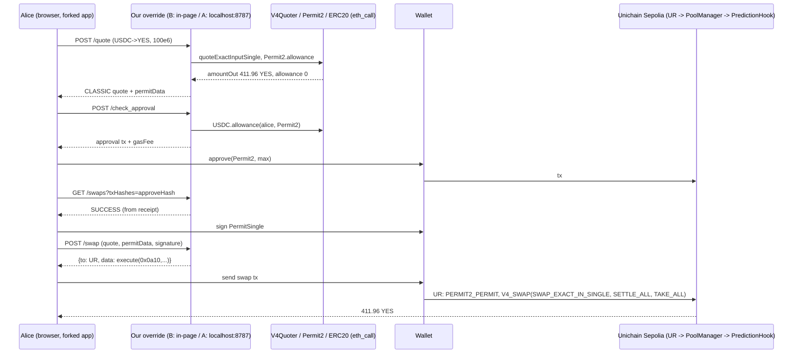

# Swap data path in the Uniswap web app, and how to make our pools swappable in a fork

Checked 2026-09-26 against `Uniswap/interface` commit `9023421e7ee21930866668d0cd4c8d1d51287e45` (2026-09-23). The shallow clone is at
`/private/tmp/claude-501/-Users-oynozan-Desktop-Dev-Web3-UniswapPrediction/1b01c4fe-2032-47bf-9776-990202883598/scratchpad/repos/uniswap-interface`
(called `$REPO` below). Paths are relative to `$REPO` and line numbers are for that commit.

Related sibling reports in this folder:
- `local-run.md` covers running the fork: patches, `.env.override`, and the browser session.
- `unichain-sepolia.md` covers contract addresses and the UR struct layouts on 1301.

This report covers the data path only. Anything I could not check is marked **UNVERIFIED**.

---

## TL;DR

1. **The Trading API does everything: quote, approval check, and the swap calldata.** Nothing is routed or encoded in the browser.
   - The app calls `POST /quote`, then `POST /check_approval`, then `POST /swap`.
   - It signs `swap.{to,data,value,gasLimit}` from the `/swap` response exactly as returned.
   - Afterwards it polls `GET /swaps?txHashes=…` to mark the approval and swap transactions as confirmed.
   - Every call goes through the singleton `TradingApiClient` (`packages/uniswap/src/data/apiClients/tradingApi/TradingApiClient.ts:182-188`).
2. **The app has no client-side routing and no on-chain quoter.**
   - Neither `apps/web` nor `packages/*` depends on `smart-order-router`.
   - `QuoteMethod.CLIENT_SIDE_FALLBACK` (`apps/web/src/state/routing/types.ts:40`) is legacy. Only the limit-order label and test constants use it.
   - `v4QuoterAbi` is exported (`packages/chains/src/abis/v4QuoterAbi.ts`, re-exported by `apps/web/src/chains/index.ts:45`), but nothing calls it.
   - `@uniswap/universal-router-sdk` is used only for constants (WETH, limit-order spender).
3. **Base URL.** `tradingApiUrl = TRADING_API_URL_OVERRIDE || getEntryGatewayUrl()` (`packages/uniswap/src/constants/urls.ts:299`).
   - The entry gateway is one of:
     - `ENTRY_GATEWAY_API_URL_OVERRIDE`;
     - `https://entry-gateway.backend-{dev|staging|prod}.api.uniswap.org`;
     - the same-origin `/entry-gateway` proxy, when `ENABLE_ENTRY_GATEWAY_PROXY=true`.
   - Paths are unversioned (`/quote`, not `/v1/quote`) (`TradingApiClient.ts:185-187`).
   - Overrides are rejected only when `ENVIRONMENT=production` (`packages/config/src/BaseConfig.ts:167-183`). `vite dev` sets `ENVIRONMENT=development`.
   - `UNISWAP_GATEWAY_DNS` is used only for UniswapX order polling (`apps/web/src/state/activity/polling/orders.ts:37`).
4. **Auth.** The public `.env` holds placeholder keys (`TRADING_API_KEY="trading_api_key"`).
   - Verified: `/quote` with that key returns **401**, and so does UniRPC `/rpc/1301` without a session.
   - `local-run.md` shows a browser session cookie unlocks both from `http://localhost:3000`.
   - Even with a session, pairs with no routable liquidity on 1301 return 404 `NoRouteFoundError`. Our hook pools will get that (per `local-run.md`).
5. **Testnet mode only filters chains.** Sepolia becomes the default and Unichain Sepolia 1301 is selectable.
   - It also hides the rate/gas row on the swap form.
   - Swaps on 1301 still go through the Trading API; 1301 is in the API's `ChainId` enum.
   - Nothing in the quote or swap path treats testnets specially.
6. **Token discovery.** The swap form resolves tokens with `useCurrencyInfo`.
   - It checks `getCommonBase()` first. This is a hard-coded list (`packages/uniswap/src/constants/routing.ts:211-216`), which has only ETH and WETH for 1301.
   - Otherwise it asks the Data API `GetToken`.
   - Verified: `GetToken` needs no auth and resolves arbitrary 1301 ERC20s. But it flags every testnet token, even Circle USDC and WETH, as `isSpam:true, verdict:STRONG_WARNING`.
   - Token-selector search and suggestions depend on Data API search and GraphQL token projects.
   - Balances come from `balanceOf` through UniRPC.
7. **The DI layer is too narrow to reuse.** `features/repositories.ts` and `services.ts` inject only the quote fetcher (TradeRepository).
   - Approval, `/swap` (both at review time and at execution time), `/swaps` polling and `/permissions` all import the `TradingApiClient` singleton directly (16 import sites).
   - **The minimal choke point is to wrap that singleton.**
8. **What the UI needs from our responses is small** (§4.2). A `CLASSIC` quote needs:
   - `input` and `output` amounts, plus `output.recipient`;
   - `gasFee`, `slippage`, and `permitData` (or `null`);
   - `route` hops with `amountIn`/`amountOut`, for the route display.

   Plus:
   - `/check_approval` returns `approval:null`, or an approve transaction plus `gasFee`;
   - `/swap` returns `swap:{to,data,value,chainId,gasLimit}`;
   - `/swaps` returns `SUCCESS` or `FAILED`.

   **If any `gasFee` is missing, the Swap button stays disabled** (`swap/utils/gas.ts:25-37`, `gas/utils.ts:247-252`).
9. **Recommendation: Strategy B**, overriding only our tokens inside the wrapped `TradingApiClient`.
   - It costs about 11–13 h, about 350 new LOC plus about 30 edited.
   - Normal tokens keep using the real API and the browser session, and there is no extra process, CORS, CSP or cookie trouble.
   - **Strategy A** (a mock server, about 12–14 h) is the fallback. It is attractive if we get a real Trading API key, or if TS edits get painful.
   - Both strategies need the same short token-registry patch (§3.4).

---

## 0. Example: Alice buys YES, then sells some back

This walkthrough is realistic, but **the numbers are illustrative**.
- Prices use plain `N(d2)` with r = 0 and a ±1¢ spread.
- The real hook uses the geometric-Asian digital, plus spread, per-block impact, caps and a band (`00-SUMMARY.md` §0.3).
- The on-chain parts assume the deployed hook behaves as the research describes.
- The HTTP parts are exactly what this interface commit sends and expects.

It assumes Strategy B, with its logic running in the browser. Under Strategy A, the same JSON goes over HTTP to `localhost:8787`.

**Setup.**
- **Market:** `ETH ≥ $4,000 at 2026-09-29 16:00 UTC`.
- **Tokens:** YES and NO, ERC20 with 6 decimals. Collateral is Circle testnet USDC `0x31d0220469e10c4E71834a79b1f276d740d3768F` (6 decimals, verified on-chain).
- **Pools:** `{YES, USDC}` and `{NO, USDC}`, both with `PredictionHook` as the hook, fee 0 and zero liquidity.
- **Pricing inputs:**
  - ETH start-of-block price from our ETH/USDC oracle-hook pool: S = 3,850.
  - σ = 60%, T = 3 days.
  - That gives fair YES = 0.2327 and NO = 0.7673, so ask ≈ 0.2427 and bid ≈ 0.2227.
- **Alice** uses MetaMask on Unichain Sepolia. She has 500 USDC from the Circle faucet and a little Sepolia ETH for gas. She has testnet mode on (`apps/web/src/components/AccountDrawer/TestnetsToggle.tsx`).

**Step 1: Alice opens the deep link.**
- The link is `http://localhost:3000/swap?chain=unichain_sepolia&inputCurrency=0x31d0…768F&outputCurrency=<YES>`.
- `useInitialCurrencyState` parses it (`apps/web/src/pages/Swap/Swap/state/hooks.tsx:29-150`).
  - The chain must match testnet mode (line 41). Otherwise the form falls back to mainnet ETH.
- `useCurrency` (`apps/web/src/hooks/Tokens.ts:46`) calls `useCurrencyInfo` (`packages/uniswap/src/features/tokens/useCurrencyInfo.ts:51-67`).
  - That returns our `getCommonBase` entry (patch §3.4), so no backend and no spam warning are involved.
- `POST /permissions {walletAddress, tokens:[usdc,yes], chainId:1301}` is answered "not permissioned" by our override.
- Balances come from `useOnChainCurrencyBalance` (`packages/uniswap/src/features/portfolio/api.ts:205`), which calls `balanceOf` over RPC. The UI shows "Balance: 500 USDC".

**Step 2: Alice types `100` in "You pay".**
- `useDerivedSwapInfo` calls the trade service, which calls `buildQuoteRequest`, which calls `TradingApiClient.fetchQuote` (`evmTradeService.ts:55-121`, the fetch is at line 95). The body is:
  ```json
  {"type":"EXACT_INPUT","amount":"100000000","tokenIn":"0x31d0…768F","tokenOut":"<YES>",
   "tokenInChainId":1301,"tokenOutChainId":1301,"swapper":"0xA11ce…",
   "autoSlippage":"DEFAULT","protocols":["V4","V3","V2"],"hooksOptions":"V4_HOOKS_INCLUSIVE","urgency":"URGENT"}
  ```
  The exact slippage and gas fields depend on flags.
- A second call, `fetchIndicativeQuote`, sends the same body with `routingPreference:"FASTEST"` (`createTradingApiClient.ts:212-217`).
- Our override sees that `tokenOut` is YES and does an `eth_call` to V4Quoter `0x56dcd40a…4472`: `quoteExactInputSingle({poolKey, zeroForOne, exactAmount:100e6, hookData:0x})`. Inside that simulation:
  1. `PoolManager.unlock` calls `swap`.
  2. `PredictionHook.beforeSwap` prices 100 USDC at the ask. It returns a `BeforeSwapDelta` that makes the curve a NoOp: +100 USDC in, −411.960710 YES out.
  3. The quoter reverts with the result: `amountOut = 411960710` plus a `gasEstimate`.
- Our override reads `Permit2.allowance(alice, USDC, UR)`. It is `(0,0,0)`, so it returns `permitData`: a `PermitSingle` for USDC with `spender = UR` and `sigDeadline = now+30m`.
- The response is a `CLASSIC` quote (full shape in §4.2). The swap form then shows:
  - **You receive 411.96 YES**;
  - rate 1 YES = 0.2427 USDC;
  - min. received 409.90 YES at 0.5% auto-slippage;
  - route "V4 · USDC → YES · 0%".
- In parallel, `useTokenApprovalInfo` sends `POST /check_approval {walletAddress, token: USDC, amount:"100000000", chainId:1301, includeGasInfo:true}` (`useTokenApprovalInfo.ts:69-117`).
  - `USDC.allowance(alice, Permit2)` is 0, so the override returns `approval = {to: USDC, data: approve(Permit2, 2^256-1), …}`, `cancel:null` and a `gasFee`.

**Step 3: Alice clicks Review.** The review screen lists three steps: **Approve USDC → Sign message → Swap**.
- No `/swap` call happens yet. On web, `usePresignPermit()` returns `undefined` (`review/services/swapTxAndGasInfoService/evm/hooks.ts:39`).
- So a quote with `permitData` produces `hasUnsignedPermit=true` and a deferred ("async") swap step (`utils.ts:421-432`, `generateSwapTransactionSteps.ts:96-102`).

**Step 4: Alice clicks Swap.** The saga (`apps/web/src/state/sagas/transactions/swapSaga.ts:241-300`) runs the steps in order.
1. **Wallet popup 1: approve.** MetaMask shows `approve(Permit2, max)` on USDC, and Alice sends it.
   - The saga waits for a `finalizeTransaction` action (`apps/web/src/state/sagas/transactions/utils.ts:505-523`).
   - That action comes from polling `GET /swaps?txHashes=0xappr…&chainId=1301` (`apps/web/src/state/activity/polling/transactions.ts:162`).
   - Our override reads the receipt and returns `SUCCESS`. **Without a working `/swaps`, the flow hangs here.**
2. **Wallet popup 2: sign the permit.** This is `eth_signTypedData_v4` of the `PermitSingle` and costs no gas.
3. **Swap request.** `POST /swap {quote:<echoed quote>, permitData, signature, simulateTransaction:true, deadline}` (`steps/swap.ts:36-49`). Our override:
   - builds `execute(commands=0x0a10, inputs=[PERMIT2_PERMIT(permit,sig), V4_SWAP(actions 0x06,0x0c,0x0f)], deadline)` against UR;
   - estimates gas;
   - returns `{swap:{to:UR, data:0x3593564c…, value:"0x00", chainId:1301, gasLimit}}`.
4. **Wallet popup 3: swap.** Alice sends the transaction to UR. On-chain:
   1. UR runs `PERMIT2_PERMIT`, which sets Permit2 allowance for USDC to UR.
   2. `V4_SWAP` runs `SWAP_EXACT_IN_SINGLE`, which calls `PoolManager.swap`. `beforeSwap` checks the cutoff, caps and band, then prices at the ask and returns the delta. The CL loop is skipped because `amountToSwap = 0`.
   3. `SETTLE_ALL` makes Permit2 `transferFrom(alice → PoolManager, 100 USDC)`.
   4. `TAKE_ALL` sends ≥ 409.90 YES (411.96 expected) to Alice.
- The UI shows success as soon as the swap is submitted: the swap step uses `shouldWaitForConfirmation: false` (`swapSaga.ts:86-93`).
- The Activity row flips to "Swapped" when `/swaps` returns `SUCCESS`.

**Step 5: Alice buys again the next hour.** Both allowances are already in place:
- the ERC20 allowance for Permit2;
- the Permit2 allowance for UR, valid for 30 days.

So:
- `/check_approval` returns `approval:null` and `/quote` returns `permitData:null`.
- The app calls `/swap` during review (legacy path, `evmSwapInstructionsService.ts:76-96`) and gets a ready transaction.
- There is **one popup: Swap**.

**Step 6: A day later ETH is 3,950. Alice sells 200 YES.**
- She flips the tokens and types 200 YES. `/quote` for YES→USDC runs `quoteExactInputSingle` and hits the hook's **bid**, giving ≈ **74.00 USDC**.
- This is her first sale of YES, so the approval and permit steps run once for YES (approve, sign, swap). The same three popups appear.

**Step 7: Cutoff and expiry.**
- After the trading cutoff, `beforeSwap` reverts, and so does the quoter.
  - Our override returns 404 `{"errorCode":"ResourceNotFound"}`, and the form shows "No routes found" (`hooks/useSwapWarnings/getSwapWarningFromError.ts:62-79`).
  - The real API's `NoRouteFoundError` code is not mapped. It falls through to the generic router warning (lines 81-98).
- Settlement uses a w-window geometric TWAP. If ETH ≥ 4,000, Alice redeems her remaining 211.96 YES for 211.96 USDC.
- Redemption goes through our own contract call or page, not through the Uniswap swap UI.



---

## 1. Where quotes and calldata come from

### 1.1 Trading API endpoints

All paths are defined in `packages/api/src/clients/trading/createTradingApiClient.ts:49-68`. With `getApiPathPrefix: () => ''` (`TradingApiClient.ts:187`), they are sent unversioned.

| Path | Method | Fetcher (`createTradingApiClient.ts`) | Called from | Used in the web EOA swap flow? |
|---|---|---|---|---|
| `/quote` | POST | `fetchQuote` 188-206, `fetchIndicativeQuote` 212-217 | `features/repositories.ts:24-25` → `tradeRepository.ts:47,96` → `evmTradeService.ts:95,134` | **Yes** (every keystroke, then polled) |
| `/check_approval` | POST | 283-290 | `data/apiClients/tradingApi/useCheckApprovalQuery.ts:23-24` ← `review/hooks/useTokenApprovalInfo.ts:113` | **Yes** (skipped if batching or the quote says `isTokenApprovalApplicable:false`) |
| `/swap` | POST | 219-233 | review time: `evm/evmSwapRepository.ts:46` via `evmSwapInstructionsService.ts:94`; execution time (after permit signature): `steps/swap.ts:41` | **Yes** |
| `/swaps` | GET `?txHashes=&chainId=&swapper=` | 361-382 | `apps/web/src/state/activity/polling/transactions.ts:162` (and bridge polling) | **Yes**, it finalizes approval and swap txs |
| `/permissions` | POST | 301-308 | `useCheckPermissionsQuery.ts:31` ← `permissionedTokens/usePermissionedSwapPair.ts` | Yes (non-blocking once it settles) |
| `/swap_5792` | POST | 251-265 | `evmSwapRepository.ts:92` | Only if `getCanBatchTransactions` is true (the `BatchedSwaps` flag, the one-click setting, and wallet atomic batching; `apps/web/src/app/WebUniswapContext.tsx:280-290`) or the swap is sponsored |
| `/swap_7702` | POST | 267-281 | `evmSwapRepository.ts:69` | Embedded (Privy) wallets with delegation only |
| `/swap_4337`, `/wallet/*` | POST | 235-249, 384-412 | wallet apps and embedded wallet | No (web sets `supportsUserOpSwaps={false}`, `WebUniswapContext.tsx:382`) |
| `/plan` | POST/GET/PATCH | 414-482 | chained actions | No. `createOrGetPlan` is commented out (`chained/chainedActionTxSwapAndGasInfoService.ts:45-56`) |
| `/order`, `/orders` | POST/GET | 310-350 | UniswapX | Only for `DUTCH_*`/`PRIORITY` routing |
| `/swappable_tokens` | GET | 352-359 | bridging token lists | No |

### 1.2 Base URL and environment variables

| Variable (read in `packages/config/src/BaseConfig.ts`) | Line | Effect |
|---|---|---|
| `TRADING_API_KEY` / `REACT_APP_TRADING_API_KEY` | 52 | Sent as `x-api-key` (`TradingApiClient.ts:37`). The public value is the placeholder `trading_api_key` (`apps/web/.env:16`). |
| `TRADING_API_URL_OVERRIDE` | 81 | Replaces the Trading API base only (`urls.ts:299`). |
| `ENTRY_GATEWAY_API_URL_OVERRIDE` | 74 | Replaces the entry gateway (Trading API, Data API ConnectRPC, UniRPC `/rpc/<chain>`, …) when the proxy is off. Env-pinned calls such as unitags bypass it (`packages/api/src/getEntryGatewayUrl.ts:65-75`). |
| `ENABLE_ENTRY_GATEWAY_PROXY` | 67 | Client side: the base becomes `/entry-gateway` (`getEntryGatewayUrl.ts:58-63`). Vite side: registers the `/entry-gateway*` proxies (`apps/web/vite.config.mts:41,594`). Vite reads **process.env at module load** (line 41), so it must be set in the shell **and** in `.env.override`. |
| `BACKEND_URL` / `VITE_BACKEND_URL` | n/a | Target of the default `/entry-gateway` Vite proxy (`apps/web/vite/entry-gateway-proxy.ts:70-77`). The default is the staging gateway in dev (`:18-32`). |
| `UNISWAP_GATEWAY_DNS` | `apps/web/src/config.ts:31` | UniswapX order polling only (`apps/web/src/state/activity/polling/orders.ts:37,63`). Not used for classic swaps. |
| `ENVIRONMENT` | defined as `mode` in `vite.config.mts:257` | `production` forbids every `*_OVERRIDE` (`BaseConfig.ts:167-183`). `vite dev` means `development`. |

Resolution order for `tradingApiUrl`:
1. `TRADING_API_URL_OVERRIDE`.
2. Otherwise `getEntryGatewayUrl()`, which picks, in order:
   1. `/entry-gateway`, if the proxy is on;
   2. `ENTRY_GATEWAY_API_URL_OVERRIDE`;
   3. `https://entry-gateway.backend-{dev,staging,prod}.api.uniswap.org` by environment (`packages/api/src/clients/base/entryGatewayUrls.ts:16-27`).

The env layers are: `apps/web/.env`, then `.env.e2e.override` (e2e only), then **`apps/web/.env.override`**, then `PROCESS_ENV_OVERRIDES` (`apps/web/vite/resolveEnvConfigs.ts:9,25-80`).

**Headers.** Every call sends `x-api-key`, the base Uniswap headers and `x-experiments` (`TradingApiClient.ts:35-42`). It also sends feature-flag headers (`TradingApiClient.ts:123-179`):
- `x-universal-router-version` is 2.1.1 if the `UseUniversalRouterVersion211` flag is on and the chain supports it, otherwise 2.0 (lines 79-92).
- `/quote` also carries `x-uniroute-pulumi-enabled: true`, plus the optional `x-uniroute-enabled`, `x-chained-actions-enabled`, `x-universal-router-swapsteps`, and so on.
- `getFeatureFlaggedHeaders` first `await`s `waitForStatsigReady()`, which has a 5 s timeout (`packages/gating/src/utils.ts:23,30-55`).

**Transport.** `credentials: 'include'` (`packages/api/src/clients/trading/createTradingApiFetchClient.ts:20-27`). The session gate passes calls through when there is no session, and awaits it otherwise (`packages/sessions/src/session-gate/requireSessionFetch.ts:28-41`, `createSession.ts:51-65`).

### 1.3 Types and how a v4 route is represented

- The schema is `packages/api/src/clients/trading/api.json`, OpenAPI with 27 paths, served at `https://trade-api.gateway.uniswap.org/v1`.
- It is compiled to `__generated__` by `nx tradingapi:generate` (`packages/api/project.json`, `openapi-typescript-codegen` plus `scripts/modifyTradingApiTypes.mts`).
- That script adds:
  - `gasStrategies` to requests;
  - `gasEstimates: GasEstimate[]` to `ApprovalResponse`, `CreateSwapResponse` and `ClassicQuote`;
  - `| null` to `NullablePermit`;
  - the routings `JUPITER` and `DUTCH_LIMIT`.
- `QuoteRequest` requires `type, amount, tokenInChainId, tokenOutChainId, tokenIn, tokenOut, swapper`. Optional fields include `slippageTolerance | autoSlippage, routingPreference, protocols, hooksOptions, urgency, permitAmount, generatePermitAsTransaction`.
- `ChainId` enum: `…,1301,84532,11155111`.
- `QuoteResponse` is `{requestId, routing, quote, permitData, permitTransaction?, permitGasFee?, isTokenApprovalApplicable?, sponsorshipInfo?}`.
- `DiscriminatedQuoteResponse` (`packages/api/src/clients/trading/tradeTypes.ts:26-49`) is `ClassicQuoteResponse | Dutch(V2|V3) | Priority | Bridge | Wrap | Unwrap | Chained`.
- `Routing` enum: `CLASSIC, DUTCH_LIMIT, DUTCH_V2, DUTCH_V3, BRIDGE, LIMIT_ORDER, PRIORITY, WRAP, UNWRAP, CHAINED` (+ `JUPITER`).
- `ClassicQuote` fields: `input{amount,token,maximumAmount}`, `output{amount,token,recipient,minimumAmount}`, `swapper, chainId, slippage, tradeType, gasFee, gasFeeUSD, gasFeeQuote, gasUseEstimate, gasPrice, maxFeePerGas, maxPriorityFeePerGas, route[][], routeString, quoteId, blockNumber, portionBips/Amount/Recipient, priceImpact, priceDifference, txFailureReasons[], aggregatedOutputs[], swapSteps[]`.
  - `swapSteps` is opt-in via `x-universal-router-swapsteps` and mirrors `SwapRouter.encodeSwaps`.
- **The v4 hop is `V4PoolInRoute`:** `{type:"v4-pool", address, tokenIn{address,chainId,symbol,decimals}, tokenOut{…}, sqrtRatioX96, liquidity, tickCurrent, fee, tickSpacing, hooks, amountIn?, amountOut?}`.
  - `hooks` is a string address, or the zero address when there is no hook.
  - The swap flow uses route hops **only for display and analytics** (`utils/routingDiagram/routingProviders/uniswapRoutingProvider.ts:134-170`, `swap/analytics.ts:43-95`).
  - `sqrtRatioX96` and `liquidity` are never used to build SDK pools in the swap path (grep for `sqrtRatioX96|liquidity` under `features/transactions/swap` finds nothing). A zero-liquidity hook pool in `route` is therefore harmless.

### 1.4 Calldata is built by the server

The trade object is a plain object built from the quote's amounts: `createBaseTradeAmounts` (`types/base.ts:57-83`) and `createClassicTrade` (`types/classic.ts:26-66`). No router-sdk `Trade` or `Route` is constructed.

The only transaction data the web app sends for a classic swap is `CreateSwapResponse.swap` (`evmSwapRepository.ts:34-41`, `steps/swap.ts:41-48`).
- It must be a `TransactionRequest` with `{to, from, data, value, chainId, gasLimit?, maxFeePerGas?, …}`.
- `isValidTransactionRequest` only requires a non-empty `to` and a numeric `chainId > 0` (`features/transactions/types/transactionRequests.ts:7-14`).

The app then submits it with wagmi (`apps/web/src/state/sagas/transactions/utils.ts`, `handleOnChainStep`).

The permit is EIP-712 `permitData` from `/quote`. The app signs it and sends the signature back to `/swap`, and the server returns calldata that includes `PERMIT2_PERMIT`.

### 1.5 Full call graph, from typing to broadcast

1. **Form state to trade.** `stores/swapFormStore/hooks/useDerivedSwapInfo.ts:53-80`.
   - It resolves currencies with `useCurrencyInfo` and balances with `useOnChainCurrencyBalance`.
   - Then `useTrade` → `hooks/useTrade/useTradeQuery.ts:20-32` (react-query, with a refetch interval per chain) → `useTradeService()` (`features/services.ts:61-70`).
2. **Service.** `createTradeService` picks EVM or SVM (`tradeService.ts:20-50`).
   - `createEVMTradeService.getTrade` (`evmTradeService.ts:55-121`) calls `createGetQuoteRoutingParams` (protocols and `hooksOptions`, `utils/tradingApi.ts:282-315`).
   - Then `createGetQuoteSlippageParams`, then `buildQuoteRequest` (`transformations/buildQuoteRequest.ts:63-111`), then `tradeRepository.fetchQuote`.
3. **Repository.** `getEVMTradeRepository()` (`features/repositories.ts:22-28`) calls `TradingApiClient.fetchQuote` and `fetchIndicativeQuote`.
4. **Quote to trade.** `transformQuoteToTrade` (`transformations/transformQuoteToTrade.ts:21-66`) → `transformTradingApiResponseToTrade` switches on `routing` (`utils/tradingApi.ts:46-127`) → `createClassicTrade`, then `validateTrade` (token addresses must match the form).
5. **Approval.** `useSwapParams` (`review/services/swapTxAndGasInfoService/hooks.ts:309-330`) → `useTokenApprovalInfo` → `/check_approval`.
   - A response of `approval === null` means `None`. An approval plus a cancel means `RevokeAndPermit2Approve`. An approval alone means `Permit2Approve`.
   - An error or missing data means `Unknown`, which blocks the swap (`useTokenApprovalInfo.ts:119-214`).
6. **Swap tx info.** `useSwapTxAndGasInfoService` (`hooks.ts:100-212`) → `createClassicSwapTxAndGasInfoService` (`classic/classicSwapTxAndGasInfoService.ts:12-31`) → `createGetEVMSwapTransactionRequestInfo` (`evm/utils.ts:26-73`) → `createEVMSwapInstructionsService` (`evm/evmSwapInstructionsService.ts:131-186`). It routes as follows:
   - **7702**, for embedded wallets with delegation;
   - **5792**, if batching or sponsored;
   - otherwise **legacy**, which is lines 64-100:
     - if `permitData` is present and there is no presigned signature (always the case on web), it returns `unsignedPermit` and defers `/swap`;
     - otherwise it calls `/swap` now.
7. **Validation.** `getClassicSwapTxAndGasInfo` (`utils.ts:411-446`) → `validateSwapTxContext` (`types/validateSwapTxContext.ts:46-80,105-150`).
   - It needs a trade, a defined `gasFee.value` with no error, and either `txRequests` or (web only) `hasUnsignedPermit` with typed-data `permit`.
8. **Steps.** `generateSwapTransactionSteps` (`utils/generateSwapTransactionSteps.ts:71-125`) builds revocation? → approval? → Permit2 signature → async swap, or approval? → swap.
9. **Execution.** `apps/web/src/state/sagas/transactions/swapSaga.ts:241-330`.
   - Approval runs `handleApprovalTransactionStep` (`utils.ts:366-389`) and waits for `finalizeTransaction` (`utils.ts:505-523`).
   - The Permit2 signature step signs typed data.
   - The swap step runs `handleSwapTransactionStep` (`swapSaga.ts:60-110`): `getSwapTxRequest` (the async step calls `/swap` with `signature` and `simulateTransaction: true`), then a wallet send, which does not wait for confirmation.
10. **Confirmation.** `usePollPendingTransactions` (`apps/web/src/state/activity/polling/transactions.ts:95-282`) polls `/swaps` for every pending non-LP tx on the connected chain. Only `SUCCESS`, `FAILED` and `EXPIRED` finalize (lines 62-66). Anything else retries up to 20 times, then marks the tx checked.

---

## 2. Testnet mode

- **The state** is `isTestnetModeEnabled` in the settings slice. It defaults to `false` (`packages/uniswap/src/features/settings/slice.ts:32`).
- **Where to toggle it:** `apps/web/src/components/AccountDrawer/TestnetsToggle.tsx`.
- **Effect on chains** (`packages/uniswap/src/features/chains/utils.ts:271-340`):
  - `getEnabledChains` keeps only chains whose `testnet` flag equals the mode (line 301).
  - The default chain becomes Sepolia (line 339).
  - Unichain Sepolia is `UNICHAIN_SEPOLIA_CHAIN_INFO` (`features/chains/evm/info/unichain.ts:90-150`): `testnet: true`, `supportsV4: true`, `supportedURVersions: [2.0, 2.1.1]` (line 140), and USDC `0x31d0…768F` (line 86).
  - It is not behind a rollout flag (`chainFeatureFlags.ts`).
- **Deep links.** A deep link to a testnet chain is honored only when testnet mode is on (`apps/web/src/pages/Swap/Swap/state/hooks.tsx:39-41`).
- **Effect on the swap path:** none.
  - 1301 passes `toTradingApiSupportedChainId` (`utils/tradingApi.ts:149-161`), so quotes still go to `/quote`.
  - `local-run.md` observed a live 1301 quote, ETH→USDC through a v3 pool.
- **UI differences in testnet mode:**
  - `TradeInfoRow` (rate and gas) is hidden (`…/TradeInfoRow/TradeInfoRow.tsx:42-44`).
  - The canonical-bridge hint is off.
  - The token selector shows token balances instead of fiat (`TokenSelectorList.tsx:88-90`).
  - Common-base chips are empty (`useAllCommonBaseCurrencies.ts:25-28`).
  - The RWA/stocks section is hidden.
  - The "portfolio is zero" gate is disabled.
- **USD values.** These come from the remote price service (`useUSDCPrice.ts`, `isRemotePriceServiceSupportedChain.ts`). Whether it prices our tokens is **UNVERIFIED**; expect no USD values.

---

## 3. Token discovery

### 3.1 How the swap form resolves an address

`useCurrencyInfo(currencyId)` (`packages/uniswap/src/features/tokens/useCurrencyInfo.ts:20-78`):
1. It returns `getCommonBase(chainId, address)` if the token is in `COMMON_BASES` (`constants/routing.ts:237-250`). This is a local constant with safety `Default`/`Benign` (`buildPartialCurrencyInfo`, `routing.ts:290-304`), so no warning is shown.
2. Otherwise it uses the Data API `GetToken`, over ConnectRPC through `entryGatewayPostTransport` (`packages/uniswap/src/data/transport.ts:49-55`), mapped by `restV2TokenToCurrencyInfo`.

The web deep-link hook `useCurrency` (`apps/web/src/hooks/Tokens.ts:46-86`) uses the same function.

There is **no on-chain ERC20 metadata fallback** in the swap token path. On-chain `decimals` lookups exist only in Toucan and PoolDetails.

### 3.2 What the Data API does with testnet tokens (verified with curl)

`POST https://entry-gateway.backend-{dev,staging,prod}.api.uniswap.org/data.v2.DataApiService/GetToken` with body `{"chainId":1301,"address":…}` returns **200 without any session or key**. Results:

| Address | Result |
|---|---|
| USDC `0x31d0…768F` | `USDC`, 6 decimals, `safety:{isSpam:true, verdict:"STRONG_WARNING"}` |
| WETH `0x4200…0006` | `WETH`, 18 decimals, `isSpam:true, STRONG_WARNING` |
| 4 random active 1301 ERC20s | all resolved (PRLUSD, USDT mock, T20, FlashD), all `isSpam:true, STRONG_WARNING` |
| UR contract (not a token) | 404 `NotFound: Token not found` |

So YES/NO would probably resolve once they have Transfer activity. Whether they are indexed immediately after deployment is **UNVERIFIED**. Every testnet token gets the spam/warning treatment.

### 3.3 Selector, search and balances

- **Search by address** uses `useMultichainSearchTokens` (`features/dataApi/searchTokens.ts`), which is Data API search.
- **Suggested tokens** use `useCommonTokensOptionsWithFallback`. The fallback reads `COMMON_BASES[chain]` but then fetches their metadata through GraphQL `tokenProjects` (`components/TokenSelector/hooks/useCurrencies.ts`, `useTokenProjectsWithoutBridgedNatives`). So a local list alone does not render chips.
- **Balances in the form** come from on-chain `balanceOf` (`features/portfolio/api.ts:72-120`, `205-251`), using `RPCType.Public`.
  - On web that is always UniRPC `${entryGateway}/rpc/1301` with `credentials:'include'` (`features/chains/evm/rpc.ts:112-114`, `features/providers/resolveRpcConfig.web.ts`, `getFeatureFlag: () => !isE2eTestEnv()`).
  - Verified: without a session it returns 401 `{"message":"Unauthorized"}`. With the browser session it works (`local-run.md`).
  - Balance unknown does **not** block the swap: `getSwapInputExceedsBalance` needs a defined balance (`utils.ts:153-159`).
- **Portfolio lists** use Data API balances. Coverage for 1301 testnet tokens is **UNVERIFIED**.

### 3.4 Minimal token patch (needed by both strategies)

- In `packages/uniswap/src/constants/routing.ts:211-216`, add three entries to `COMMON_BASES[UniverseChainId.UnichainSepolia]`: `new Token(1301, USDC, 6, 'USDC', 'USD Coin')`, YES and NO. This takes about 5 lines. Resolution then needs no backend and shows no spam warning.
- Optional:
  - add a "Prediction markets" section in `useTokenSectionsForSwap` (`components/TokenSelector/lists/TokenSelectorSwapList.tsx:33-120`) built with `currencyInfosToTokenOptions(localList)`. This takes about 15 lines, so the selector shows YES/NO without backend search.
  - default `isTestnetModeEnabled: true` (`settings/slice.ts:32`). Note that the persisted state wins.
- For the demo itself, drive the form with the deep link `…/swap?chain=unichain_sepolia&inputCurrency=<USDC>&outputCurrency=<YES>`.

---

## 4. The injection layer, and the patch points for our pools

### 4.1 What the injection layer covers

| File | What it injects | Covers our need? |
|---|---|---|
| `packages/uniswap/src/features/repositories.ts:22-28` | `getEVMTradeRepository()` → `{fetchQuote, fetchIndicativeQuote}` from `TradingApiClient` | Quotes only |
| `packages/uniswap/src/features/services.ts:40-70` | `getTradeService()`, `useTradeService()` (EVM or SVM trade services) | Quotes only |
| `packages/uniswap/src/domains/repositories.ts`, `services.ts` | Delegation (`/wallet/check_delegation`) | No |
| `swapTxAndGasInfoService/hooks.ts:100-212` | Builds routing to tx-info services in a hook (not injectable from outside) | Uses `TradingApiClient` directly inside `evmSwapRepository.ts` |
| `UniswapContext` (`apps/web/src/app/WebUniswapContext.tsx`) | `getCanBatchTransactions`, `getSwapDelegationInfo`, `getCanSignPermits`, … | Only flow selection |

The approval hook, the async swap step, `/swaps` polling and `/permissions` all import the singleton directly:

```
$ grep -rn "import.*TradingApiClient" apps/web/src packages/uniswap/src | grep -v test | awk -F: '{print $3}' | sort | uniq -c
  16 import { TradingApiClient } from 'uniswap/src/data/apiClients/tradingApi/TradingApiClient'
```

**Conclusion.** The one place that sees every call is the exported object at `packages/uniswap/src/data/apiClients/tradingApi/TradingApiClient.ts:182-188`. A server that impersonates the Trading API at its base URL sees the same calls.

### 4.2 What the UI reads from each response

Traced field by field. These are the shapes our override or mock must return. `apps/web/src/playwright/mocks/tradingApi/*.json` confirms that a minimal quote without `route` renders in e2e.

**`POST /quote`** returns a `ClassicQuoteResponse`:

```json
{
  "requestId": "pm-<uuid>",
  "routing": "CLASSIC",
  "permitData": { "domain": {"name":"Permit2","chainId":1301,"verifyingContract":"0x000000000022D473030F116dDEE9F6B43aC78BA3"},
                  "types": {"PermitSingle":[…],"PermitDetails":[…]},
                  "values": {"details":{"token":"<USDC>","amount":"1461501637330902918203684832716283019655932542975","expiration":"<now+30d>","nonce":"0"},
                             "spender":"<UR>","sigDeadline":"<now+30m>"} },
  "quote": {
    "chainId": 1301, "swapper": "<alice>", "tradeType": "EXACT_INPUT",
    "input":  {"token":"<USDC>","amount":"100000000"},
    "output": {"token":"<YES>","amount":"411960710","minimumAmount":"409900906","recipient":"<alice>"},
    "slippage": 0.5,
    "gasFee": "375000000000", "gasFeeUSD": "0", "gasUseEstimate": "250000", "gasPrice": "1500000",
    "blockNumber": "635xxxxx", "quoteId": "pm-<uuid>", "routeString": "[V4] USDC --0%/PredictionHook--> YES",
    "route": [[{"type":"v4-pool","address":"<poolId>","tokenIn":{"address":"<USDC>","chainId":1301,"symbol":"USDC","decimals":"6"},
                "tokenOut":{"address":"<YES>","chainId":1301,"symbol":"YES","decimals":"6"},
                "sqrtRatioX96":"79228162514264337593543950336","liquidity":"0","tickCurrent":"0",
                "fee":"0","tickSpacing":"1","hooks":"<PredictionHook>","amountIn":"100000000","amountOut":"411960710"}]],
    "portionBips": 0
  }
}
```

| Field | Read by | Required? |
|---|---|---|
| `routing:"CLASSIC"` | `transformTradingApiResponseToTrade` (`utils/tradingApi.ts:49`) | Yes |
| `quote.input.amount`, `quote.output.amount` | `createBaseTradeAmounts` (`types/base.ts:66-71`); if either is missing the trade is null | Yes |
| `input.token`/`output.token`, `output.recipient` | indicative validation (`types/trade.ts:166-184`) | Yes for indicative quotes |
| `output.minimumAmount` / `input.maximumAmount` | min received and max sold (`base.ts:73-74`, defaults to the exact amounts) | Recommended |
| `quote.slippage` | `trade.slippageTolerance` (`classic.ts:53`) | Recommended |
| `quote.gasFee` (wei string) | `processSwapResponse` → `gasFeeResult.value` (`utils.ts:251-255`). **If undefined, `validateGasFeeResult` fails and the button is disabled.** | **Yes** |
| `permitData` | `null` means no permit. An object means Permit2 signature step plus deferred `/swap` on web | Yes (may be null) |
| `route[][]` with `amountIn`/`amountOut` | routing diagram. Percent = hop amount / total (`uniswapRoutingProvider.ts:144-167`). Label "V4". Fee is `parseInt(fee)`, and `8388608` shows as dynamic | Optional (for display) |
| `priceDifference` (percent) | price-impact warning if > medium (`getPriceDifferenceWarning.ts:45-62`) | Optional. Omit it to avoid warnings |
| `txFailureReasons` | simulation error, which blocks (`utils.ts:182-209`) | Omit |
| `portionBips/portionAmount`, `aggregatedOutputs` | fee row (`getTradingApiSwapFee.ts:16-40`) | Omit or 0 |
| `isTokenApprovalApplicable:false` | skips `/check_approval` entirely (`useTokenApprovalInfo.ts:53,111`) | Do not send it. We need the approval check |

**`POST /check_approval`** returns an `ApprovalResponse`.
- Already approved: `{"requestId":"…","approval":null,"cancel":null}`.
- Approval needed: `{"requestId":"…","approval":{"to":"<token>","from":"<alice>","data":"0x095ea7b3<Permit2><ff..ff>","value":"0x00","chainId":1301,"gasLimit":"60000"},"cancel":null,"gasFee":"90000000000","cancelGasFee":"0"}`.
- A non-null `cancel` switches to the revoke-then-approve flow. `gasFee` is required when `approval` is set; otherwise the approval gas is undefined and the button is disabled (`useTokenApprovalInfo.ts:186-214`, `swap/utils/gas.ts:29-31`).

**`POST /swap`** (request `{quote, permitData?, signature?, simulateTransaction, deadline, refreshGasPrice, urgency|gasStrategies}`) returns a `CreateSwapResponse`:
`{"requestId":"…","swap":{"from":"<alice>","to":"<UR>","data":"0x3593564c…","value":"0x00","chainId":1301,"gasLimit":"<est*1.2>"},"gasFee":"…"}`.
- `chainId` must be a **number**.
- Only estimate gas when `simulateTransaction` is true. It is false when an approval is still pending (`utils.ts:120`), and an estimate would revert.

**`GET /swaps?txHashes=h1,h2&chainId=1301&swapper=…`** returns a `GetSwapsResponse`:
`{"requestId":"…","swaps":[{"txHash":"h1","status":"SUCCESS","swapType":"CLASSIC"}]}`.
- `status` is taken from the receipt: `SUCCESS` or `FAILED`.
- Anything else (for example `PENDING`) makes the client retry. Approvals are polled too.

**`POST /permissions`** returns `{"requestId":"…","results":[{"token":"<addr>","isPermissioned":false}]}` (`PermissionsResult` requires `token, isPermissioned`). A failure does not block, but the form waits while the call is loading.

**Calldata** for the UR `execute(bytes commands, bytes[] inputs, uint256 deadline)` (selector `0x3593564c`):
- The commands are `[PERMIT2_PERMIT 0x0a (only when signature present), V4_SWAP 0x10]`.
- The V4 actions are:
  - exact-in: `SWAP_EXACT_IN_SINGLE 0x06, SETTLE_ALL 0x0c(tokenIn, amountIn), TAKE_ALL 0x0f(tokenOut, minOut)`;
  - exact-out: `SWAP_EXACT_OUT_SINGLE 0x08, SETTLE_ALL(tokenIn, maxIn), TAKE_ALL(tokenOut, amountOut)`.
- The action and command constants were checked in `repos/v4-periphery/src/libraries/Actions.sol:28-45` and `repos/universal-router/contracts/libraries/Commands.sol:27,35`.
- **The struct layout must match the router.** Per `unichain-sepolia.md`:
  - UR 2.0 `0xf70536b3…e5d` (Stack A) uses the **5-field** struct; encode with v4-sdk `URVersion.V2_0`.
  - UR 2.1.2 `0xDf38F24f…7E95` (Stack A) uses the 6-field struct; encode with `URVersion.V2_1_1`.
  - **Never use UR 2.1.1 `0x8B844f88…` on 1301.** It is wired to the other PoolManager.
  - So **ignore `x-universal-router-version`**, even though the app sends 2.1.1 when that flag is on.
  - The permit `spender` must be the same router we call.

Verified with the SDKs installed in the interface (`scratchpad/swapdata/encode_check.cjs`, output `encode_check.out`). This used placeholder YES and hook addresses:
```
UR 2.0 address for 1301: 0xf70536b3bcc1bd1a972dc186a2cf84cc6da6be5d
permitData.domain: {"name":"Permit2","chainId":1301,"verifyingContract":"0x000000000022D473030F116dDEE9F6B43aC78BA3"}
permitData.types keys: PermitSingle,PermitDetails
commands: 0x0a10 calldata bytes: 1508 selector: 0x3593564c
parsed commands: PERMIT2_PERMIT -> V4_SWAP
V4 actions: SWAP_EXACT_IN_SINGLE{poolKey{…fee:0,tickSpacing:1,hooks:0x…C8}, zeroForOne:false, amountIn:0x05f5e100, amountOutMinimum:0x0e1ee139, hookData:0x} -> SETTLE_ALL(USDC, 0x05f5e100) -> TAKE_ALL(YES, 0x0e1ee139)
quoter call reverted as expected for placeholder pool: The contract function "quoteExactInputSingle" reverted …
```

The building blocks are already dependencies of both `packages/uniswap` and `apps/web`: `@uniswap/universal-router-sdk@5.11.3` (`RoutePlanner`, `CommandType`, `CommandParser`, `UNIVERSAL_ROUTER_ADDRESS`), `@uniswap/v4-sdk@2.3.0` (`V4Planner`, `Actions`, `URVersion`), `@uniswap/permit2-sdk@1.4.0` (`AllowanceTransfer.getPermitData`) and `viem@2.49.0`.

**Permit2 logic.** This mirrors what the real API does, as observed through the UI contract.
1. `/check_approval`: if `ERC20.allowance(owner, Permit2) < amount`, return `approve(Permit2, 2^256-1)`.
2. `/quote`: read `Permit2.allowance(owner, token, UR)`, which returns `(amount, expiration, nonce)`. If `amount < needed` or `expiration <= now+60`, return `permitData` with the current `nonce`, amount `2^160-1`, `expiration = now+30d` and `sigDeadline = now+30min`. Otherwise return `null`.
3. `/swap`: if both `signature` and `permitData` are present, prepend `PERMIT2_PERMIT(permitData.values, signature)`.

For native ETH input (optional multi-hop), there is no approval or permit, and `value = amountIn`.

**Gas.**
- `gasPrice` comes from `eth_gasPrice`, about 0.0015 gwei on 1301 (per `unichain-sepolia.md`).
- `gasUseEstimate` is the quoter's `gasEstimate` plus about 120k of UR overhead. A constant 250k is fine.
- `gasFee = gasUseEstimate × gasPrice`.
- `/swap gasLimit` is `eth_estimateGas × 1.2` when `simulateTransaction`, otherwise 400000.
- Approval: `gasLimit` 60000, `gasFee = 60000 × gasPrice`.
- The UI converts gas with `convertGasFeeToDisplayValue` and the active gas strategy. In testnet mode the form's gas row is hidden anyway.

**Route display.** `RoutingInfo` / `BestRouteTooltip` show provider "Uniswap API" (with the Uniswap logo), one row "100% · V4", and a hop USDC → YES at "0%". The hook address is **not displayed**; it is only sent to analytics.

### 4.3 Strategy A: a local mock Trading API (or entry gateway)

**Process.** A single Bun or Node HTTP server of about 400–500 LOC using viem and the SDKs above, run from `$REPO` so it can resolve `node_modules`, for example `scratchpad/pm-gateway/server.ts`. It has a JSON config: chainId, RPC URL, UR address and version, V4Quoter, Permit2, and pools as `{tokenA, tokenB, fee, tickSpacing, hooks, hookData}`.

**Endpoints to implement.** Only our pairs on 1301 are handled locally:
- `OPTIONS *` reflects `Origin`, sets `Allow-Credentials: true`, and echoes `Access-Control-Request-Headers`. This is needed because the client uses `credentials:'include'` and sends custom headers.
- `POST /quote` and `POST /check_approval` and `POST /swap` follow §4.2.
- `GET /swaps` uses receipts for chain 1301.
- `POST /permissions` returns a stub.
- Optional: `POST /swap_5792` returns `{requestId, chainId:1301, calls:[approve?, swap]}`, in case the batching flag is on. Alternatively the user turns off one-click swaps.
- Everything else, and non-our pairs, goes to upstream (below).

**Wiring options.**

| Option | Env / files | Pros | Cons |
|---|---|---|---|
| **A1 (simplest):** `TRADING_API_URL_OVERRIDE=http://localhost:8787` in `apps/web/.env.override` | Add `"http://localhost:8787"` to `apps/web/public/dev-csp.json` `connectSrc`. The CSP is injected by `cspMetaTagPlugin` (`apps/web/vite/vite.plugins.ts:42-75`, `vite.config.mts:390`); `connect-src` otherwise allows only `'self'`, `*.uniswap.org`, `*.drpc.org`, … (`public/csp.json`). Or run with `SKIP_CSP=true`. | UniRPC and Data API keep using the real gateway and the browser session. The mock is tiny. | Non-our pairs cannot be proxied with the user's session: the cookie belongs to `*.uniswap.org`, not `localhost:8787`, so they get 401. A real Trading API key would fix this, by proxying to `https://trade-api.gateway.uniswap.org/v1/<path>` with `x-api-key`. Key availability for 1301 is **UNVERIFIED**. Without a key, normal-token swaps break in the fork. |
| **A2 (faithful proxy):** `ENABLE_ENTRY_GATEWAY_PROXY=true` (**shell and** `.env.override`), `BACKEND_URL=http://localhost:8787` (shell) | The mock forwards everything else to `https://entry-gateway.backend-staging.api.uniswap.org`, passing `Cookie` and `Set-Cookie` through. The Vite proxy already rewrites cookie Domain, Secure and SameSite for localhost (`vite/entry-gateway-proxy.ts:115-181`). | Same origin, so no CORS or CSP issues. Sessions, UniRPC, Data API and normal swaps all keep working through the mock. | Relies on the Vite proxy and the Cloudflare dev plugin not also claiming `/entry-gateway/*`. The BFF has its own `/entry-gateway/*` route (`apps/web/functions/app.ts:132`); which one wins in dev is **UNVERIFIED**. The mock must stream ConnectRPC/grpc-web and preserve headers. |
| A3: `ENTRY_GATEWAY_API_URL_OVERRIDE=http://localhost:8787` | CSP entry as in A1 | Also lets the mock serve `/rpc/1301` from a public RPC | Session cookies set via the mock land on `localhost:8787` with the wrong domain for upstream. Same 401 problem as A1 for anything that needs a session. |

**Files and LOC for A1.** Changes in the fork are the token patch (§3.4, about 5–20 LOC), one line in `.env.override`, and one line in `dev-csp.json`. The mock is 400–500 LOC.

**Effort for A (hours).**

| Task | Hours |
|---|---|
| Server skeleton, CORS, upstream passthrough, config | 1.5 |
| `/quote` exact-in and exact-out, permitData, gas, route | 2.5 |
| `/check_approval`, `/permissions`, `/swaps` | 1.0 |
| `/swap` (PERMIT2_PERMIT + V4_SWAP, 5 or 6 fields), gas | 2.0 |
| `/swap_5792` (optional) | 0.5 |
| Fork env, CSP, token patch, testnet default | 1.5 |
| End-to-end on 1301 with MetaMask: buy and sell, exact-in and exact-out, first-time and repeat | 3.0 |
| Buffer | 1.0 |
| **Total** | **12–14** |

**A-specific risks.**
- Every quote pays `await waitForStatsigReady()` (up to 5 s) in `getFeatureFlaggedHeaders` if Statsig never reaches Ready. `local-run.md` got quotes, so Statsig is probably fine (**UNVERIFIED**).
- The cookie and proxy issues in the table above.
- One more process to keep alive during the demo.

### 4.4 Strategy B: override inside the TS service layer (recommended)

**Idea.** Wrap the singleton. For calls that involve our tokens on 1301, answer locally with the same shapes as §4.2. Delegate everything else to the real client, which uses the real API and the session. No fetch leaves the page for our pairs except JSON-RPC `eth_call`, `eth_estimateGas` and `eth_getTransactionReceipt`.

**Files.**

| # | File | Change | LOC |
|---|---|---|---|
| 1 | NEW `packages/uniswap/src/features/predictionMarkets/config.ts` | Chain id, USDC/YES/NO, pool keys, UR address and URVersion (`V2_0` for `0xf705…` or `V2_1_1` encoding for UR 2.1.2 `0xDf38…`), V4Quoter, Permit2, RPC URL `https://unichain-sepolia.drpc.org` (already allowed by CSP `https://*.drpc.org/`; `sepolia.unichain.org` is **not** in `public/csp.json`) | ~40 |
| 2 | NEW `packages/uniswap/src/features/predictionMarkets/predictionTradingApi.ts` | `viem` `createPublicClient`. Functions `quote`, `checkApproval`, `swap`, `swaps`, `permissions` returning `TradingApi.*` types. `withPredictionMarketOverrides(base: TradingApiClient): TradingApiClient` overrides `fetchQuote`, **`fetchIndicativeQuote`** (the base one calls its internal `fetchQuote` closure, so it must be overridden separately), `fetchCheckApproval`, `fetchSwap`, `fetchSwaps` (chain 1301 and our hashes, or simply all 1301 hashes, via receipts), `fetchCheckPermissions` (filter our tokens), and optionally `fetchSwap5792` | ~300 |
| 3 | EDIT `packages/uniswap/src/data/apiClients/tradingApi/TradingApiClient.ts:182-188` | `const base = createTradingApiClient({...}); export const TradingApiClient = withPredictionMarketOverrides(base)` | ~5 |
| 4 | EDIT `packages/uniswap/src/constants/routing.ts:211-216` | Token registry (§3.4) | ~5 |
| 5 | Optional EDIT `components/TokenSelector/lists/TokenSelectorSwapList.tsx` | Local "Prediction markets" section | ~15 |
| 6 | Optional EDIT `features/settings/slice.ts:32` | Testnet mode on by default | 1 |
| 7 | Only if balances fail (no session) | `features/providers/resolveRpcConfig.web.ts` (skip UniRPC for 1301) plus `features/chains/evm/info/unichain.ts:127` (Public RPC set to drpc). **UNVERIFIED** that this alone is enough, because `asUniRpcConfig` re-promotes any URL under the gateway `/rpc/` | ~5 |

Short-circuiting before `createFetcher` also skips `waitForStatsigReady`, CORS, CSP and cookies for our pairs. Normal pairs are unchanged.

**Shared behavior.** Permit2, gas and route display are identical to §4.2. They are just computed in the page.

**Effort for B (hours).**

| Task | Hours |
|---|---|
| Config module | 0.5 |
| `predictionTradingApi.ts` (quote, approval, swap, swaps, permissions), unit script against 1301 | 4.5 |
| Wrap the singleton, token patch, optional selector section | 1.5 |
| Monorepo typecheck, lint and HMR friction (`bun web typecheck`, oxlint) | 1–2 |
| End-to-end on 1301 | 3.0 |
| Optional RPC override | 0.5–1 |
| **Total** | **11–13** |

**B-specific risks.**
- `packages/uniswap` is shared with mobile and the extension. That does not matter for the fork, but keep the override web-only if we ever upstream.
- Quotes poll the public drpc endpoint from the browser, so free-tier rate limits apply (**UNVERIFIED** limits). Use a keyed RPC if needed.
- Wrong-token detection must normalize addresses (lowercase) and the chain id.

### 4.5 Risks common to A and B, with mitigations

1. **Quote drift and slippage.** The hook prices from the start-of-block S with per-block impact. A quote from block N executed at N+k can drift beyond the default 0.5% auto-slippage.
   - Set a custom slippage of 1–2% for the demo; `customSlippageTolerance` becomes `slippageTolerance` in the request.
   - Return `slippage` accordingly.
   - The quote refetch interval keeps the numbers fresh.
2. **Router struct and address mismatch.** A wrong layout reverts with no data (5 vs 6 fields).
   - Pin UR and URVersion in config. Never follow the app's UR header.
   - The permit `spender` must equal the `to` address.
3. **`/swaps` must work.** Otherwise approval and Permit2-transaction steps never finalize and the saga waits forever (`utils.ts:505-523`). Both strategies implement it from receipts.
4. **Missing `gasFee` means a dead Swap button.** Always return string `gasFee` on quote and approval responses.
5. **Batching path.** If the `BatchedSwaps` flag is on and the wallet reports atomic batching (for example a MetaMask 7702 smart account), the app calls `/swap_5792` instead of `/swap`.
   - Implement it, or have the demo wallet turn off one-click swaps (`useOneClickSwapSetting`).
   - The flag's value for localhost is **UNVERIFIED**.
6. **Token warnings.** Without the `COMMON_BASES` patch, YES and USDC come from the Data API as STRONG_WARNING spam and trigger warning modals.
7. **V4Quoter needs an exact fill, and the deployed quoters lack `msgSender()`** (`00-SUMMARY.md` §1.5). The hook must not call `IMsgSender(sender).msgSender()` unguarded, or it becomes unquotable.
8. **After cutoff or halt,** the hook reverts. Map the quoter revert to specific errors so the UI shows a useful warning (`getSwapWarningFromError.ts:51-79`):
   - HTTP 404 `{"errorCode":"ResourceNotFound"}` shows "No routes found".
   - `{"errorCode":"QuoteAmountTooLowError"}` shows "Enter a larger amount". Use it for zero-amount or dust reverts.
   - Any other code shows the generic "router error".
9. **Running the fork at all** (config pull, Privy, WalletConnect env, session challenge) is covered in `local-run.md`.

---

## 5. Commands run and their output

```sh
# Trading API with the public placeholder key (all 401)
curl -X POST https://entry-gateway.backend-prod.api.uniswap.org/quote -H 'x-api-key: trading_api_key' -d '{…1301 USDC->ETH…}'
# {"errorCode":"Unauthorized","detail":"Unauthenticated api key or session"} HTTP 401   (same for backend-staging and trade-api.gateway.uniswap.org/v1)

# CORS preflight from localhost:3000 to the prod gateway
curl -X OPTIONS https://entry-gateway.backend-prod.api.uniswap.org/quote -H 'origin: http://localhost:3000' -H 'access-control-request-method: POST' -H 'access-control-request-headers: content-type,x-api-key'
# HTTP/2 204, access-control-allow-origin: http://localhost:3000, access-control-allow-credentials: true, allow-headers: Content-Type, X-Api-Key

# UniRPC without a session
curl -X POST https://entry-gateway.backend-prod.api.uniswap.org/rpc/1301 -d '{"jsonrpc":"2.0","id":1,"method":"eth_chainId","params":[]}'
# {"message":"Unauthorized"} HTTP 401
# Public RPCs: https://unichain-sepolia.drpc.org and https://sepolia.unichain.org both return {"result":"0x515"}

# Contracts on 1301 (eth_getCode length in hex chars)
# V4Quoter 0x56dcd40a…4472: 11642 | UR 2.0 0xf70536b3…e5d: 39082 | UR 2.1.1 0x8B844f88…1E6b: 49094 | Permit2: 18306 | PoolManager 0x00b036b5…62ac: 48020 | USDC 0x31d0…768F: 3598
# USDC decimals() = 6, symbol() = "USDC"

# Data API GetToken (no auth) on dev, staging and prod: 200. Results in §3.2.

# Calldata and permit encoding with the installed SDKs
source scratchpad/env.sh && node scratchpad/swapdata/encode_check.cjs   # output in §4.2
```

---

## 6. UNVERIFIED

- Whether the Data API indexes freshly deployed YES and NO immediately (other 1301 tokens resolve, all flagged spam).
- Whether the `BatchedSwaps`, `UseUniversalRouterVersion211` and `UniswapX` flags are on for a localhost fork. This decides whether `/swap_5792` or the 2.1.1 header shows up.
- Strategy A2: whether the Vite `/entry-gateway` proxy or the Cloudflare dev worker handles `/entry-gateway/*` first in `vite dev`.
- Whether a real Trading API key (developer portal) works for chain 1301 (the enum includes it). That would make A1 proxy normal pairs.
- Remote price service coverage (USD values) for our tokens on 1301.
- drpc free-tier rate limits under quote polling (Strategy B).
- The RPC override in B7 is sufficient on its own (`asUniRpcConfig` promotion logic).
- The whole on-chain part of the Alice walkthrough (hook deltas, quoter result) assumes the hook behaves as specified in `00-SUMMARY.md`. No pool is deployed yet; the quoter call in `encode_check.cjs` reverts on a placeholder pool, as expected.
